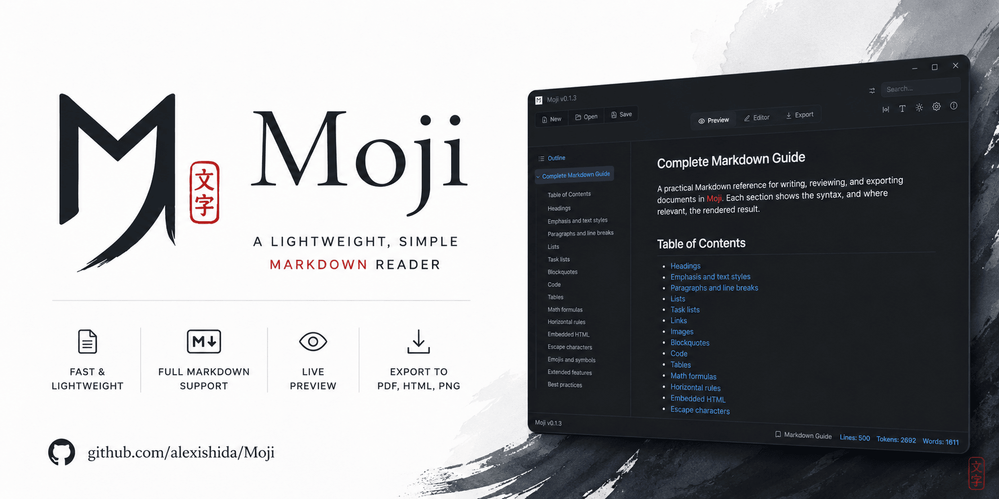

<p align="center">
  
</p>

<h1 align="center">Moji</h1>

<p align="center">A lightweight, clean desktop app for opening, reading, editing, and exporting Markdown files.</p>

<p align="center">Built with Electron, React, TypeScript, and electron-vite.</p>

<p align="center"><strong>Current version:</strong> v0.1.4</p>

<p align="center">
  
</p>

<p align="center">
  <strong>Download:</strong>
  <a href="https://github.com/alexishida/Moji/releases/download/v0.1.4/Moji.Setup.0.1.4.exe">Windows</a>
  ·
  <a href="https://github.com/alexishida/Moji/releases/download/v0.1.4/Moji-0.1.4-universal.dmg">macOS (DMG)</a>
  ·
  <a href="https://github.com/alexishida/Moji/releases/download/v0.1.4/Moji-0.1.4-x86_64.AppImage">Linux (AppImage)</a>
  ·
  <a href="https://github.com/alexishida/Moji/releases/download/v0.1.4/Moji-0.1.4-amd64.deb">Linux (DEB)</a>
</p>


## Name

**Moji (文字)** literally means "letter", "character", or "writing" in Japanese. Short and easy to remember, it evokes characters and writing. The name fits its purpose: opening, editing, previewing, and exporting Markdown smoothly—without distractions.

## Features

- **Open Markdown files**: supports `.md` and `.markdown` through file dialog, drag and drop, CLI/file association entry points, and single-instance forwarding.
- **Multi-document workspace**: horizontal tabs, dirty markers, close buttons, duplicate-file detection, and unsaved-change confirmation with clear action icons.
- **Tab management**: close other tabs, tabs to the right, saved tabs, or all tabs from the document tab menu.
- **Preview mode**: sanitized Markdown rendering with heading anchors, outline navigation, tables, task lists, footnotes, definition lists, subscript/superscript, highlight/insert marks, emoji shortcodes, LaTeX math via KaTeX (`$…$` and `$$…$$`), linkify, typographer, syntax-highlighted code, and copy buttons for code blocks.
- **Mermaid diagrams**: every valid fenced `mermaid` block supported by bundled Mermaid renders as a responsive diagram, including flowcharts, sequence, Gantt, class, ER, state, and journey diagrams. Click a diagram to inspect it in a modal with zoom, drag navigation, a minimap, and individual PNG export; malformed diagrams remain readable code blocks.
- **Outline navigation**: collapsible heading tree with scroll-spy that highlights the heading nearest the viewport top, plus smooth scroll-to-heading on click and anchor links.
- **Search and replace**: top-bar search highlights matches in preview/editor, shows occurrence count, jumps to the next match, and replaces one match or all matches in the active document.
- **Editor mode**: CodeMirror 6 Markdown editor with line numbers, history, wrapping, localized untitled document names, Markdown formatting shortcuts, and save/save as flows.
- **Export mode**: export the active document as HTML, PDF, or PNG. PDF supports A4, Letter, Legal, portrait, and landscape; long code lines wrap in PDF and PNG exports.
- **Diagram exports**: rendered Mermaid diagrams are embedded as self-contained SVG in HTML, PDF, and PNG exports.
- **Settings view**: centered in-workspace panel for language, preview typography, and a localized shortcut reference.
- **About view**: in-workspace panel showing app name, version (from `package.json`), author, repository link, and the story behind the name.
- **Markdown guide**: bundled localized reference documents (`samples/markdown-guide.<locale>.md`) opened from the status bar.
- **Recent files**: Welcome screen shows recently opened Markdown files and lets you reopen or remove entries.
- **Remembered app state**: window size/position, recent files, last used folder, language, preview typography, and Markdown preview theme are persisted in user settings.
- **Automatic updates**: installed Windows NSIS and Linux AppImage builds check GitHub Releases, show download progress, and restart only after protecting unsaved documents.
- **Markdown themes**: dark/light toggle for rendered Markdown. App chrome remains dark; exports always use the light theme.
- **Internationalization**: English, Portuguese (Brazil), Spanish, Japanese, Chinese, and Russian. Initial language follows the OS when possible and user choice is persisted.
- **Security**: sandboxed renderer, context isolation, `nodeIntegration: false`, DOMPurify sanitization, and external links opened in the OS browser.
- **Keyboard shortcuts**: common file, search, replace, tab, preview, export, fullscreen, and font-size actions; Settings lists every available shortcut.

## Screenshots

<p align="center">
  
  
</p>

<p align="center">
  
  
</p>


## Requirements

- Node.js `^20.19.0 || >=22.12.0` (required by Vite 7 and electron-vite 5; packaging also needs `require()` of ES modules, unflagged since Node 22.12)
- npm

## Development

```bash
npm install
npm run dev
npm run typecheck
npm test
npm run build
```

Useful scripts:

- `npm run dev`: launch Electron with hot reload.
- `npm run typecheck`: run TypeScript checks without emitting files.
- `npm test`: run the Vitest suite once (`npm run test:watch` for watch mode).
- `npm run build`: build main, preload, and renderer into `out/`.
- `npm run preview`: run the built app preview.

## Packaging

```bash
npm run dist
npm run dist:win
npm run dist:linux
npm run dist:mac
```

Artifacts are written to `release/`.

Current packaging targets:

- Windows: NSIS installer, x64, with automatic updates.
- Linux: AppImage with automatic updates, plus deb for manual installation.
- macOS: universal (Apple Silicon + Intel) DMG and ZIP, without automatic updates.

File associations for `.md` and `.markdown` are declared in `electron-builder.yml`.

### macOS builds

macOS releases are **not code-signed or notarized**, because that requires a paid Apple Developer account. Consequences:

- Gatekeeper quarantines the app when the DMG is downloaded from the web. Users must either right-click the app and choose *Open*, or clear the quarantine flag: `xattr -dr com.apple.quarantine /Applications/Moji.app`.
- Automatic updates stay disabled on macOS. Squirrel.Mac refuses to replace an unsigned bundle, so `updater.ts` reports `unsupported` there and users update by downloading a new DMG.

To sign locally, install an Apple Developer ID certificate in the keychain and drop the `CSC_IDENTITY_AUTO_DISCOVERY=false` override; `build/entitlements.mac.plist` and `hardenedRuntime` are already configured for notarization.

### Publishing a release

1. Update `version` in `package.json` and `package-lock.json`.
2. Commit changes, then create and push matching tag such as `v0.2.0`.
3. `.github/workflows/release.yml` validates tag, then builds Windows, Linux, and macOS in that order, uploading each platform's artifacts to a draft release. No binary is attached by hand.
4. Workflow makes GitHub Release public once Windows and Linux have succeeded: NSIS, AppImage, DEB, and the `latest.yml` / `latest-linux.yml` update metadata.

A Windows or Linux failure leaves the release as a draft. A macOS failure does not: the publish step waits for the macOS job to finish, so the release is never made public while the DMG is still uploading, but it does not require it to have succeeded. macOS is unsigned and secondary, and a broken DMG should not hold back a good Windows and Linux release. The macOS job still fails visibly in the workflow.

`electron-updater` runs only in packaged Windows NSIS builds and Linux AppImages. Development and deb builds do not self-update. AppImage must live in a user-writable directory to be replaced successfully. Windows production releases should use an Authenticode certificate through electron-builder signing environment variables; never store certificate credentials in repository.

## Project Structure

```text
electron/
  main.ts        Window lifecycle, persisted bounds, file opening, single-instance flow, close guard, macOS application menu, IPC registration
  preload.ts     Safe renderer API exposed through contextBridge
  shared.ts      Shared IPC names, settings, export types, languages, recent-file limits, supported extensions
  updater.ts     GitHub release checks, update download state, and NSIS/AppImage installation
  settings.ts    User settings persistence, window bounds, recent files, preview theme, and last dialog directory
  export.ts      HTML/PDF/PNG export implementation with remembered output directory
  png.ts         Streaming PNG encoder used to keep tall-document exports within memory

src/
  App.tsx        Renderer state, document actions, close guard wiring, mode switching
  components/    Top bar, tabs, sidebar, outline tree, preview, Mermaid viewer, editor, export/settings/about dialogs, confirm dialog, welcome view
  lib/           Markdown rendering, Mermaid rendering, outline extraction, preview scroll-spy, export HTML, hooks
  locales/       en, pt-BR, es, ja, zh, ru translation files
  styles/        Theme tokens, app shell CSS, Markdown preview CSS

samples/         Bundled Markdown documents (full Markdown guide)
```

## Documentation

- `.ai-framework/RULES.md`: project rules for AI-assisted changes.
- `.ai-framework/DESIGN.md`: visual system, tokens, layout, and component rules.
- `openspec/specs/`: current behavior specs.

## License

MIT © Alex Ishida
