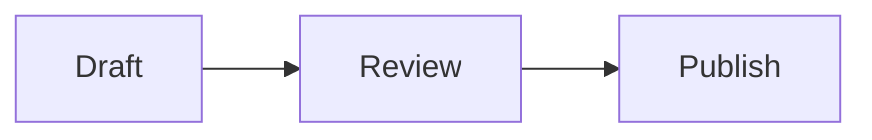
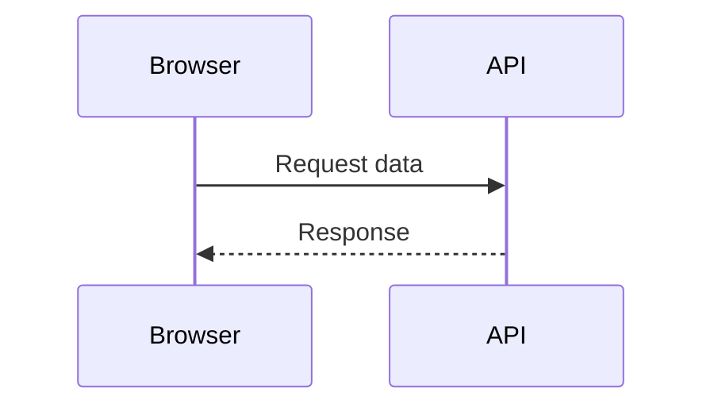
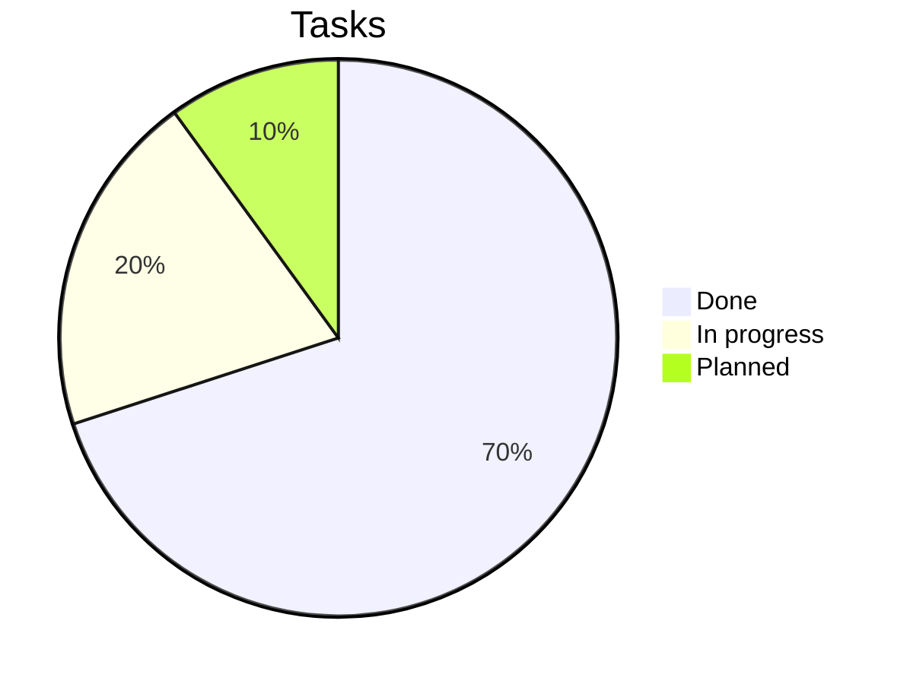

# Complete Markdown Guide

A practical Markdown reference for writing, reviewing, and exporting documents in **Moji**.
Each section shows the syntax and, where relevant, the rendered result.

## Table of Contents

- [Headings](#headings)
- [Emphasis and text styles](#emphasis-and-text-styles)
- [Paragraphs and line breaks](#paragraphs-and-line-breaks)
- [Lists](#lists)
- [Task lists](#task-lists)
- [Links](#links)
- [Images](#images)
- [Blockquotes](#blockquotes)
- [Code](#code)
- [Tables](#tables)
- [Math formulas](#math-formulas)
- [Horizontal rules](#horizontal-rules)
- [Embedded HTML](#embedded-html)
- [Escape characters](#escape-characters)
- [Emojis and symbols](#emojis-and-symbols)
- [Extended features](#extended-features)
- [Mermaid diagrams](#mermaid-diagrams)
- [Best practices](#best-practices)

---

## Headings

Use one to six `#` symbols to create headings from level 1 to 6. Moji's sidebar outline uses these headings for navigation, so keep levels in order.

~~~markdown
# Level 1 heading
## Level 2 heading
### Level 3 heading
#### Level 4 heading
##### Level 5 heading
###### Level 6 heading
~~~

> Tip: use only **one** `#` per document as the main page title.

---

## Emphasis and text styles

| Syntax | Result |
|---------|-----------|
| `*italic*` or `_italic_` | *italic* |
| `**bold**` or `__bold__` | **bold** |
| `***bold and italic***` | ***bold and italic*** |
| `~~strikethrough~~` | ~~strikethrough~~ |
| `` `inline code` `` | `inline code` |

Example in context:

> When running `npm run typecheck`, **TypeScript** is validated without generating files; errors appear *inline* in the terminal.

---

## Paragraphs and line breaks

Separate paragraphs with a **blank line**. A simple line break, without a blank line, is ignored by default.

~~~markdown
First paragraph.

Second paragraph, separated by a blank line.
~~~

To force a break within the same paragraph, end the line with **two spaces** or use `\`:

~~~markdown
Line one  
Line two within the same thought
~~~

---

## Lists

**Unordered** — use `-`, `*`, or `+`. Indent with two spaces to nest.

~~~markdown
- Main item
  - Sub-item
    - Sub-sub-item
- Another item
~~~

Result:

- Main item
  - Sub-item
    - Sub-sub-item
- Another item

**Ordered** — numbers followed by a dot. Markdown auto-renumbers for you.

~~~markdown
1. First step
2. Second step
   1. Sub-step A
   2. Sub-step B
3. Third step
~~~

Result:

1. First step
2. Second step
   1. Sub-step A
   2. Sub-step B
3. Third step

---

## Task lists

Use `- [ ]` for pending and `- [x]` for completed.

~~~markdown
- [x] Write the guide
- [x] Add tables
- [ ] Review before exporting
~~~

Result:

- [x] Write the guide
- [x] Add tables
- [ ] Review before exporting

---

## Links

~~~markdown
[Inline link](https://example.com)
[Link with title](https://example.com "Shows on hover")
<https://example.com>  ← automatic link
[Reference-style link][ref]

[ref]: https://example.com
~~~

Internal links point to a heading's *slug* (the same one the outline uses):

~~~markdown
Go back to [Table of Contents](#table-of-contents).
~~~

> In Moji, `http`/`https` links open in the system browser, in a new tab, with `rel="noopener noreferrer"`.

---

## Images

Same syntax as links, with `!` in front. The text in brackets is the **alt text** (for accessibility).

~~~markdown


~~~

Always describe the image in the alt text — screen readers and the export feature depend on it.

---

## Blockquotes

Use `>` at the start of a line. Blockquotes can contain other elements and be nested.

~~~markdown
> A simple blockquote.
>
> > Nested blockquote.
>
> — Author, **Source**
~~~

Result:

> A simple blockquote.
>
> > Nested blockquote.
>
> — Author, **Source**

---

## Code

**Inline:** wrap with single backticks — `` `renderMarkdown()` ``.

**Block:** use a triple-backtick fence and specify the language to enable syntax highlighting (powered by `highlight.js`).

~~~markdown
```ts
export function renderMarkdown(source: string): string {
  const html = md.render(source ?? '')
  return DOMPurify.sanitize(html)
}
```
~~~

Result:

```ts
export function renderMarkdown(source: string): string {
  const html = md.render(source ?? '')
  return DOMPurify.sanitize(html)
}
```

Other language examples:

```bash
npm install
npm run dev
```

```json
{
  "name": "moji",
  "version": "0.1.0"
}
```

---

## Tables

Columns separated by `|`. The second row defines the separator and **alignment**:

- `:---` left-align
- `:---:` center
- `---:` right-align

~~~markdown
| Feature      | Supported | Notes                  |
| :----------- | :-------: | ---------------------: |
| Tables       |    Yes    |       Great for data   |
| Tasks        |    Yes    |  Useful in checklists  |
| Highlighting |    Yes    |       via highlight.js |
~~~

Result:

| Feature      | Supported | Notes                  |
| :----------- | :-------: | ---------------------: |
| Tables       |    Yes    |       Great for data   |
| Tasks        |    Yes    |  Useful in checklists  |
| Highlighting |    Yes    |       via highlight.js |

A denser comparison table:

| Format   | Extension  | Exports in Moji | Best for            |
| -------- | ---------- | :-------------: | ------------------- |
| HTML     | `.html`    |       Yes       | Web publishing      |
| PDF      | `.pdf`     |       Yes       | Print / archive     |
| PNG      | `.png`     |       Yes       | Screenshots & previews |
| Markdown | `.md`      |       Yes       | Editing the source  |

> Cells support formatting: **bold**, *italic*, `code`, and links.

---

## Math formulas

The standard convention uses **LaTeX** between dollar signs: `$...$` for **inline** formulas and `$$...$$` for **display** (block, centered) formulas.

**Inline:**

~~~markdown
Energy is given by $E = mc^2$ and the theorem is $a^2 + b^2 = c^2$.
~~~

Result: Energy is given by $E = mc^2$ and the theorem is $a^2 + b^2 = c^2$.

**Display:**

~~~markdown
$$
x = \frac{-b \pm \sqrt{b^2 - 4ac}}{2a}
$$
~~~

Result:

$$
x = \frac{-b \pm \sqrt{b^2 - 4ac}}{2a}
$$

Useful syntax examples:

| Purpose         | LaTeX                                   |
| --------------- | --------------------------------------- |
| Fraction        | `\frac{a}{b}`                           |
| Superscript     | `x^{2}`                                 |
| Subscript       | `x_{i}`                                 |
| Root            | `\sqrt{x}` · `\sqrt[3]{x}`              |
| Summation       | `\sum_{i=1}^{n} i`                       |
| Integral        | `\int_{a}^{b} f(x)\,dx`                  |
| Limit           | `\lim_{x \to \infty} f(x)`              |
| Greek letters   | `\alpha \beta \gamma \pi \Sigma \Omega` |
| Vector          | `\vec{v}`                               |
| Matrix          | `\begin{bmatrix} a & b \\ c & d \end{bmatrix}` |

Complete block example:

~~~markdown
$$
\sum_{i=1}^{n} i = \frac{n(n+1)}{2}
\qquad
e^{i\pi} + 1 = 0
$$

$$
\int_{0}^{\infty} e^{-x^2}\,dx = \frac{\sqrt{\pi}}{2}
$$

$$
A = \begin{bmatrix} 1 & 2 \\ 3 & 4 \end{bmatrix}
$$
~~~

Result:

$$
\sum_{i=1}^{n} i = \frac{n(n+1)}{2}
\qquad
e^{i\pi} + 1 = 0
$$

$$
\int_{0}^{\infty} e^{-x^2}\,dx = \frac{\sqrt{\pi}}{2}
$$

$$
A = \begin{bmatrix} 1 & 2 \\ 3 & 4 \end{bmatrix}
$$

> **In Moji:** formulas are rendered with **KaTeX** — `$…$` appears inline and `$$…$$` in a centered display block. Wide equations get horizontal scrolling, and an invalid formula turns into red error text without breaking the rest of the document.

---

## Horizontal rules

Three or more `-`, `*`, or `_` on their own line, with blank lines before and after.

~~~markdown
---
~~~

Produces a separator:

---

## Embedded HTML

Markdown accepts plain HTML for cases the syntax doesn't cover. In Moji, everything goes through **DOMPurify**: unsafe tags and attributes (like `<script>` or `onclick`) are removed before preview and export.

~~~markdown
<details>
  <summary>Click to expand</summary>

  Hidden content, revealed on click.
</details>
~~~

Result:

<details>
  <summary>Click to expand</summary>

  Hidden content, revealed on click.
</details>

---

## Escape characters

Use `\` before a special character to display it literally, without interpreting it.

~~~markdown
\*this won't become italic\*
\# this won't become a heading
1\. this won't start a list
~~~

Common escapables: `` \ ` * _ { } [ ] ( ) # + - . ! | ``

---

## Emojis and symbols

Paste Unicode emojis directly — they work in headings, lists, and tables.

~~~markdown
- ✅ Done
- 🚧 In progress
- ❌ Blocked
- 💡 Idea
- ⚠️ Warning
~~~

Result:

- ✅ Done
- 🚧 In progress
- ❌ Blocked
- 💡 Idea
- ⚠️ Warning

Common symbols via HTML: `&copy;` → &copy;, `&rarr;` → &rarr;, `&hearts;` → &hearts;.

---

## Extended features

Beyond basic Markdown, Moji also renders common extensions.

**Subscript and superscript** — `~x~` and `^x^`:

~~~markdown
H~2~O · area = πr^2^ · a^n^ + b^n^
~~~

Result: H~2~O · area = πr^2^ · a^n^ + b^n^

**Highlight and insertion** — `==text==` and `++text++`:

~~~markdown
This is ==important== and this was ++inserted++.
~~~

Result: This is ==important== and this was ++inserted++.

**Shortcut emojis** — `:name:`:

~~~markdown
:rocket: :sparkles: :white_check_mark: :warning: :bulb:
~~~

Result: :rocket: :sparkles: :white_check_mark: :warning: :bulb:

**Footnotes** — mark with `[^id]` and define the note anywhere; it appears at the bottom of the document.

~~~markdown
A claim with a source.[^source]

[^source]: Reference detail, displayed at the end of the document.
~~~

Result: A claim with a source.[^source]

**Definition lists** — a term followed by lines starting with `:`.

~~~markdown
Markdown
: A lightweight markup language for formatted text.

KaTeX
: A fast LaTeX math formula rendering engine.
~~~

Result:

Markdown
: A lightweight markup language for formatted text.

KaTeX
: A fast LaTeX math formula rendering engine.

**Abbreviations** — define an acronym and all occurrences get a tooltip on hover.

~~~markdown
*[HTML]: HyperText Markup Language
~~~

*[HTML]: HyperText Markup Language

[^source]: Reference detail, displayed at the end of the document.

---

## Mermaid diagrams

Moji renders Mermaid diagrams in the preview. Click a rendered diagram to open the viewer, zoom, pan, and export it as PNG.

**Flowchart**:

~~~markdown

~~~


**Sequence diagram**:



**Pie chart**:



<!-- MERMAID_EXAMPLES -->

---

## Best practices

- Start with **one** `#` heading and keep the level hierarchy in order.
- Leave **blank lines** between blocks (headings, lists, tables, blockquotes).
- Prefer fenced blocks with a language tag for multi-line code.
- Write descriptive **alt text** for every image.
- Use tables for comparisons; use lists for sequences or collections.
- **Preview before exporting** to HTML, PDF, or PNG.

---

> Guide generated for **Moji** · Markdown viewer and editor. Open this file in the app and switch between **edit** and **preview** to see each example.
