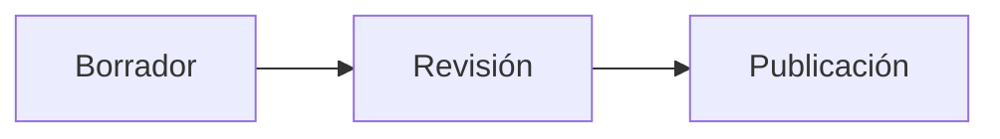
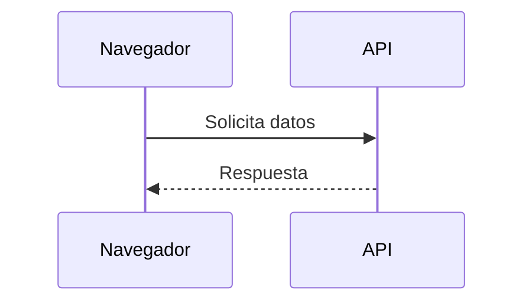
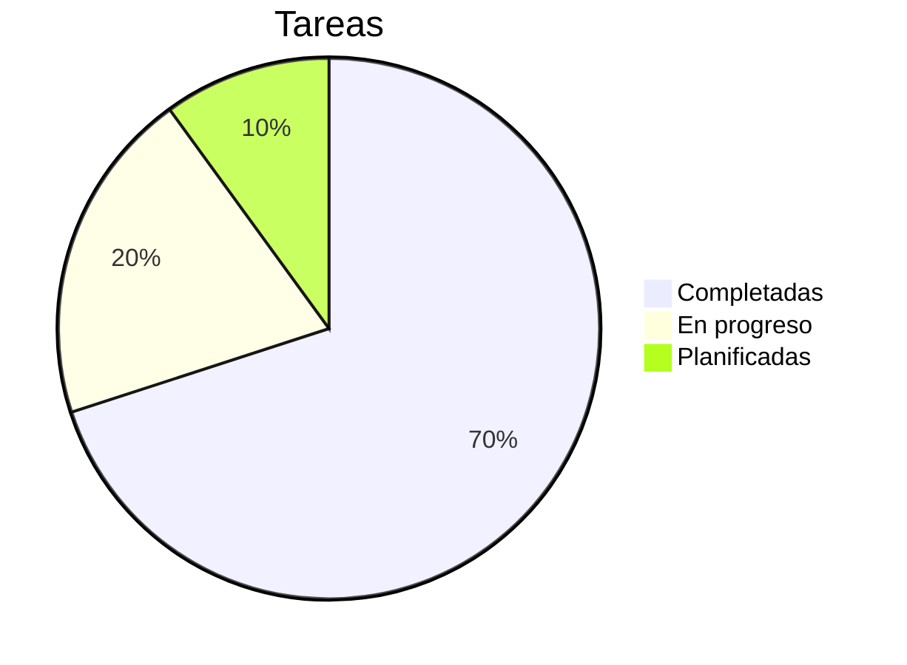

# Guía Completa de Markdown

Referencia práctica de Markdown para escribir, revisar y exportar documentos en **Moji**.
Cada sección muestra la sintaxis y, cuando corresponde, el resultado ya renderizado.

## Índice

- [Encabezados](#encabezados)
- [Énfasis y estilos de texto](#%C3%A9nfasis-y-estilos-de-texto)
- [Párrafos y saltos de línea](#p%C3%A1rrafos-y-saltos-de-l%C3%ADnea)
- [Listas](#listas)
- [Listas de tareas](#listas-de-tareas)
- [Enlaces](#enlaces)
- [Imágenes](#im%C3%A1genes)
- [Citas](#citas)
- [Código](#c%C3%B3digo)
- [Tablas](#tablas)
- [Fórmulas matemáticas](#f%C3%B3rmulas-matem%C3%A1ticas)
- [Líneas horizontales](#l%C3%ADneas-horizontales)
- [HTML embebido](#html-embebido)
- [Caracteres de escape](#caracteres-de-escape)
- [Emojis y símbolos](#emojis-y-s%C3%ADmbolos)
- [Funciones extendidas](#funciones-extendidas)
- [Diagramas Mermaid](#diagramas-mermaid)
- [Buenas prácticas](#buenas-pr%C3%A1cticas)

---

## Encabezados

Usa de uno a seis `#` para crear encabezados del nivel 1 al 6. El esquema lateral de Moji usa estos encabezados para navegar, así que mantén los niveles en orden.

~~~markdown
# Encabezado nivel 1
## Encabezado nivel 2
### Encabezado nivel 3
#### Encabezado nivel 4
##### Encabezado nivel 5
###### Encabezado nivel 6
~~~

> Consejo: usa solo **un** `#` por documento, como título principal de la página.

---

## Énfasis y estilos de texto

| Sintaxis | Resultado |
|---------|-----------|
| `*cursiva*` o `_cursiva_` | *cursiva* |
| `**negrita**` o `__negrita__` | **negrita** |
| `***negrita y cursiva***` | ***negrita y cursiva*** |
| `~~tachado~~` | ~~tachado~~ |
| `` `código en línea` `` | `código en línea` |

Ejemplo en contexto:

> Al ejecutar `npm run typecheck`, **TypeScript** se valida sin generar archivos; los errores aparecen *en línea* en la terminal.

---

## Párrafos y saltos de línea

Separa párrafos con **una línea en blanco**. Un salto de línea simple, sin línea en blanco, se ignora por defecto.

~~~markdown
Primer párrafo.

Segundo párrafo, separado por una línea en blanco.
~~~

Para forzar un salto dentro del mismo párrafo, termina la línea con **dos espacios** o usa `\`:

~~~markdown
Línea uno  
Línea dos dentro de la misma idea
~~~

---

## Listas

**No ordenadas** — usa `-`, `*` o `+`. Indenta con dos espacios para anidar.

~~~markdown
- Elemento principal
  - Subelemento
    - Sub-subelemento
- Otro elemento
~~~

Resultado:

- Elemento principal
  - Subelemento
    - Sub-subelemento
- Otro elemento

**Ordenadas** — números seguidos de punto. Markdown renumera automáticamente.

~~~markdown
1. Primer paso
2. Segundo paso
   1. Sub-paso A
   2. Sub-paso B
3. Tercer paso
~~~

Resultado:

1. Primer paso
2. Segundo paso
   1. Sub-paso A
   2. Sub-paso B
3. Tercer paso

---

## Listas de tareas

Usa `- [ ]` para pendiente y `- [x]` para completado.

~~~markdown
- [x] Escribir la guía
- [x] Agregar tablas
- [ ] Revisar antes de exportar
~~~

Resultado:

- [x] Escribir la guía
- [x] Agregar tablas
- [ ] Revisar antes de exportar

---

## Enlaces

~~~markdown
[Enlace en línea](https://example.com)
[Enlace con título](https://example.com "Aparece al pasar el mouse")
<https://example.com>  ← enlace automático
[Enlace de referencia][ref]

[ref]: https://example.com
~~~

Los enlaces internos apuntan al *slug* de un encabezado (el mismo que usa el esquema):

~~~markdown
Vuelve al [Índice](#%C3%ADndice).
~~~

> En Moji, los enlaces `http`/`https` se abren en el navegador del sistema, en una nueva pestaña, con `rel="noopener noreferrer"`.

---

## Imágenes

Misma sintaxis que los enlaces, con `!` adelante. El texto entre corchetes es el **texto alternativo** (accesibilidad).

~~~markdown


~~~

Siempre describe la imagen en el texto alternativo — los lectores de pantalla y la exportación dependen de ello.

---

## Citas

Usa `>` al inicio de la línea. Pueden contener otros elementos y anidarse.

~~~markdown
> Cita simple.
>
> > Cita anidada.
>
> — Autor, **Fuente**
~~~

Resultado:

> Cita simple.
>
> > Cita anidada.
>
> — Autor, **Fuente**

---

## Código

**En línea:** envuelve con acentos graves simples — `` `renderMarkdown()` ``.

**En bloque:** usa una cerca de tres acentos graves e indica el lenguaje para activar el resaltado de sintaxis (con `highlight.js`).

~~~markdown
```ts
export function renderMarkdown(source: string): string {
  const html = md.render(source ?? '')
  return DOMPurify.sanitize(html)
}
```
~~~

Resultado:

```ts
export function renderMarkdown(source: string): string {
  const html = md.render(source ?? '')
  return DOMPurify.sanitize(html)
}
```

Otros ejemplos de lenguaje:

```bash
npm install
npm run dev
```

```json
{
  "name": "moji",
  "version": "0.1.0"
}
```

---

## Tablas

Columnas separadas por `|`. La segunda fila define el separador y la **alineación**:

- `:---` alinear a la izquierda
- `:---:` centrar
- `---:` alinear a la derecha

~~~markdown
| Funcionalidad | Soportada | Notas                 |
| :------------ | :-------: | --------------------: |
| Tablas        |    Sí     |   Ideal para datos    |
| Tareas        |    Sí     |  Útil en checklists   |
| Resaltado     |    Sí     |    via highlight.js   |
~~~

Resultado:

| Funcionalidad | Soportada | Notas                 |
| :------------ | :-------: | --------------------: |
| Tablas        |    Sí     |   Ideal para datos    |
| Tareas        |    Sí     |  Útil en checklists   |
| Resaltado     |    Sí     |    via highlight.js   |

Tabla comparativa más densa:

| Formato  | Extensión  | Exporta en Moji | Ideal para           |
| -------- | ---------- | :-------------: | -------------------- |
| HTML     | `.html`    |       Sí        | Publicar en la web   |
| PDF      | `.pdf`     |       Sí        | Imprimir / archivar  |
| PNG      | `.png`     |       Sí        | Capturas y vistas previas |
| Markdown | `.md`      |       Sí        | Editar la fuente     |

> Las celdas aceptan formato: **negrita**, *cursiva*, `código` y enlaces.

---

## Fórmulas matemáticas

La convención estándar usa **LaTeX** entre signos de dólar: `$...$` para fórmulas **en línea** y `$$...$$` para fórmulas **en bloque** (destacadas y centradas).

**En línea:**

~~~markdown
La energía se expresa como $E = mc^2$ y el teorema es $a^2 + b^2 = c^2$.
~~~

Resultado: La energía se expresa como $E = mc^2$ y el teorema es $a^2 + b^2 = c^2$.

**En bloque:**

~~~markdown
$$
x = \frac{-b \pm \sqrt{b^2 - 4ac}}{2a}
$$
~~~

Resultado:

$$
x = \frac{-b \pm \sqrt{b^2 - 4ac}}{2a}
$$

Ejemplos útiles de sintaxis:

| Propósito       | LaTeX                                   |
| --------------- | --------------------------------------- |
| Fracción        | `\frac{a}{b}`                           |
| Superíndice     | `x^{2}`                                 |
| Subíndice       | `x_{i}`                                 |
| Raíz            | `\sqrt{x}` · `\sqrt[3]{x}`              |
| Sumatorio       | `\sum_{i=1}^{n} i`                       |
| Integral        | `\int_{a}^{b} f(x)\,dx`                  |
| Límite          | `\lim_{x \to \infty} f(x)`              |
| Letras griegas  | `\alpha \beta \gamma \pi \Sigma \Omega` |
| Vector          | `\vec{v}`                               |
| Matriz          | `\begin{bmatrix} a & b \\ c & d \end{bmatrix}` |

Bloque de ejemplo completo:

~~~markdown
$$
\sum_{i=1}^{n} i = \frac{n(n+1)}{2}
\qquad
e^{i\pi} + 1 = 0
$$

$$
\int_{0}^{\infty} e^{-x^2}\,dx = \frac{\sqrt{\pi}}{2}
$$

$$
A = \begin{bmatrix} 1 & 2 \\ 3 & 4 \end{bmatrix}
$$
~~~

Resultado:

$$
\sum_{i=1}^{n} i = \frac{n(n+1)}{2}
\qquad
e^{i\pi} + 1 = 0
$$

$$
\int_{0}^{\infty} e^{-x^2}\,dx = \frac{\sqrt{\pi}}{2}
$$

$$
A = \begin{bmatrix} 1 & 2 \\ 3 & 4 \end{bmatrix}
$$

> **En Moji:** las fórmulas se renderizan con **KaTeX** — `$…$` aparece en línea y `$$…$$` en bloque centrado. Las ecuaciones anchas obtienen desplazamiento horizontal, y una fórmula inválida se convierte en texto de error rojo sin romper el resto del documento.

---

## Líneas horizontales

Tres o más `-`, `*` o `_` en una línea propia, con líneas en blanco antes y después.

~~~markdown
---
~~~

Produce un separador:

---

## HTML embebido

Markdown acepta HTML puro para casos que la sintaxis no cubre. En Moji, todo pasa por **DOMPurify**: las etiquetas y atributos inseguros (como `<script>` u `onclick`) se eliminan antes de la vista previa y la exportación.

~~~markdown
<details>
  <summary>Haz clic para expandir</summary>

  Contenido oculto, revelado al hacer clic.
</details>
~~~

Resultado:

<details>
  <summary>Haz clic para expandir</summary>

  Contenido oculto, revelado al hacer clic.
</details>

---

## Caracteres de escape

Usa `\` antes de un carácter especial para mostrarlo literalmente, sin interpretarlo.

~~~markdown
\*esto no se vuelve cursiva\*
\# esto no se vuelve encabezado
1\. esto no inicia una lista
~~~

Escapables comunes: `` \ ` * _ { } [ ] ( ) # + - . ! | ``

---

## Emojis y símbolos

Pega emojis Unicode directamente — funcionan en encabezados, listas y tablas.

~~~markdown
- ✅ Completado
- 🚧 En progreso
- ❌ Bloqueado
- 💡 Idea
- ⚠️ Advertencia
~~~

Resultado:

- ✅ Completado
- 🚧 En progreso
- ❌ Bloqueado
- 💡 Idea
- ⚠️ Advertencia

Símbolos comunes vía HTML: `&copy;` → &copy;, `&rarr;` → &rarr;, `&hearts;` → &hearts;.

---

## Funciones extendidas

Más allá del Markdown básico, Moji también renderiza extensiones comunes.

**Subíndice y superíndice** — `~x~` y `^x^`:

~~~markdown
H~2~O · área = πr^2^ · a^n^ + b^n^
~~~

Resultado: H~2~O · área = πr^2^ · a^n^ + b^n^

**Resaltado e inserción** — `==texto==` y `++texto++`:

~~~markdown
Esto es ==importante== y esto fue ++insertado++.
~~~

Resultado: Esto es ==importante== y esto fue ++insertado++.

**Emojis por atajo** — `:nombre:`:

~~~markdown
:rocket: :sparkles: :white_check_mark: :warning: :bulb:
~~~

Resultado: :rocket: :sparkles: :white_check_mark: :warning: :bulb:

**Notas al pie** — marca con `[^id]` y define la nota en cualquier lugar; aparece al final del documento.

~~~markdown
Afirmación con fuente.[^fuente]

[^fuente]: Detalle de la referencia, mostrado al final del documento.
~~~

Resultado: Afirmación con fuente.[^fuente]

**Listas de definición** — un término seguido de líneas que empiezan con `:`.

~~~markdown
Markdown
: Un lenguaje de marcado ligero para texto formateado.

KaTeX
: Un motor rápido de renderizado de fórmulas LaTeX.
~~~

Resultado:

Markdown
: Un lenguaje de marcado ligero para texto formateado.

KaTeX
: Un motor rápido de renderizado de fórmulas LaTeX.

**Abreviaturas** — define una sigla y todas las ocurrencias obtienen información al pasar el mouse.

~~~markdown
*[HTML]: HyperText Markup Language
~~~

*[HTML]: HyperText Markup Language

[^fuente]: Detalle de la referencia, mostrado al final del documento.

---

## Diagramas Mermaid

Moji renderiza diagramas Mermaid en la vista previa. Haz clic en un diagrama renderizado para abrir el visor, aplicar zoom, arrastrar y exportarlo como PNG.

**Diagrama de flujo**:

~~~markdown

~~~


**Diagrama de secuencia**:



**Gráfico circular**:



<!-- MERMAID_EXAMPLES -->

---

## Buenas prácticas

- Empieza con **un** encabezado `#` y mantén la jerarquía de niveles en orden.
- Deja **líneas en blanco** entre bloques (encabezados, listas, tablas, citas).
- Prefiere bloques cercados con etiqueta de lenguaje para código de varias líneas.
- Escribe **texto alternativo** descriptivo en cada imagen.
- Usa tablas para comparar; usa listas para secuencias o colecciones.
- **Revisa en la vista previa** antes de exportar a HTML, PDF o PNG.

---

> Guía generada para **Moji** · visor y editor de Markdown. Abre este archivo en la app y cambia entre **edición** y **vista previa** para ver cada ejemplo.
