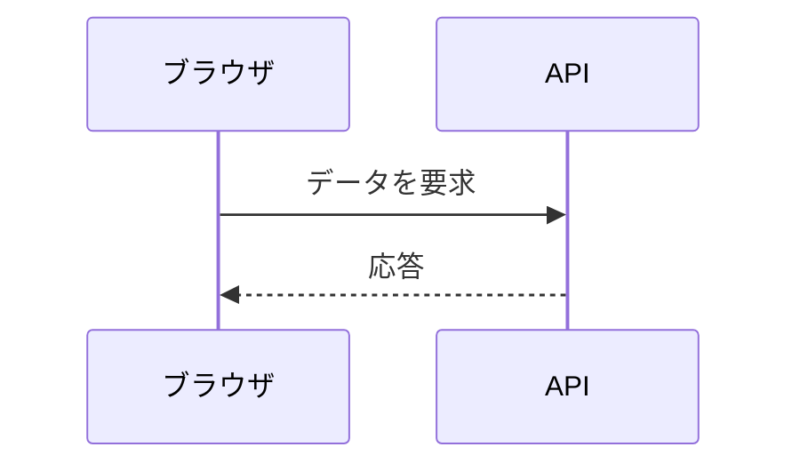
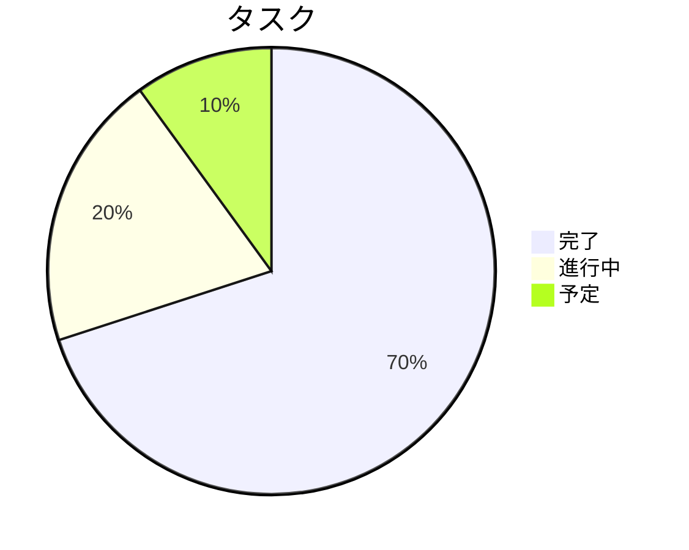

# Markdown 完全ガイド

**Moji** で文書を作成・レビュー・エクスポートするための Markdown 実用リファレンスです。
各セクションでは構文と、該当する場合はレンダリング結果を表示します。

## 目次

- [見出し](#%E8%A6%8B%E5%87%BA%E3%81%97)
- [強調とテキストスタイル](#%E5%BC%B7%E8%AA%BF%E3%81%A8%E3%83%86%E3%82%AD%E3%82%B9%E3%83%88%E3%82%B9%E3%82%BF%E3%82%A4%E3%83%AB)
- [段落と改行](#%E6%AE%B5%E8%90%BD%E3%81%A8%E6%94%B9%E8%A1%8C)
- [リスト](#%E3%83%AA%E3%82%B9%E3%83%88)
- [タスクリスト](#%E3%82%BF%E3%82%B9%E3%82%AF%E3%83%AA%E3%82%B9%E3%83%88)
- [リンク](#%E3%83%AA%E3%83%B3%E3%82%AF)
- [画像](#%E7%94%BB%E5%83%8F)
- [引用](#%E5%BC%95%E7%94%A8)
- [コード](#%E3%82%B3%E3%83%BC%E3%83%89)
- [テーブル](#%E3%83%86%E3%83%BC%E3%83%96%E3%83%AB)
- [数式](#%E6%95%B0%E5%BC%8F)
- [水平線](#%E6%B0%B4%E5%B9%B3%E7%B7%9A)
- [埋め込み HTML](#%E5%9F%8B%E3%82%81%E8%BE%BC%E3%81%BF-html)
- [エスケープ文字](#%E3%82%A8%E3%82%B9%E3%82%B1%E3%83%BC%E3%83%97%E6%96%87%E5%AD%97)
- [絵文字と記号](#%E7%B5%B5%E6%96%87%E5%AD%97%E3%81%A8%E8%A8%98%E5%8F%B7)
- [拡張機能](#%E6%8B%A1%E5%BC%B5%E6%A9%9F%E8%83%BD)
- [Mermaid ダイアグラム](#mermaid-%E3%83%80%E3%82%A4%E3%82%A2%E3%82%B0%E3%83%A9%E3%83%A0)
- [ベストプラクティス](#%E3%83%99%E3%82%B9%E3%83%88%E3%83%97%E3%83%A9%E3%82%AF%E3%83%86%E3%82%A3%E3%82%B9)

---

## 見出し

1 〜 6 個の `#` を使ってレベル 1 〜 6 の見出しを作成します。Moji のサイドバーアウトラインはこれらの見出しをナビゲーションに使用するため、レベルは順序どおりに保ちましょう。

~~~markdown
# レベル 1 見出し
## レベル 2 見出し
### レベル 3 見出し
#### レベル 4 見出し
##### レベル 5 見出し
###### レベル 6 見出し
~~~

> ヒント: ドキュメントごとに **1 つ** の `#` だけをメインページタイトルとして使用しましょう。

---

## 強調とテキストスタイル

| 構文 | 結果 |
|---------|-----------|
| `*斜体*` または `_斜体_` | *斜体* |
| `**太字**` または `__太字__` | **太字** |
| `***太字・斜体***` | ***太字・斜体*** |
| `~~取り消し線~~` | ~~取り消し線~~ |
| `` `インラインコード` `` | `インラインコード` |

文中の例:

> `npm run typecheck` を実行すると、**TypeScript** がファイルを生成せずに検証され、エラーがターミナルに *インライン* で表示されます。

---

## 段落と改行

段落は **空行** で区切ります。空行を挟まない単純な改行は、デフォルトでは無視されます。

~~~markdown
最初の段落。

空行で区切られた二番目の段落。
~~~

同じ段落内で強制的に改行するには、行末に **スペース 2 つ** を置くか `\` を使います:

~~~markdown
一行目  
同じ段落内の二行目
~~~

---

## リスト

**番号なしリスト** — `-`、`*`、または `+` を使います。ネストするにはスペース 2 つでインデントします。

~~~markdown
- メイン項目
  - サブ項目
    - サブサブ項目
- 別の項目
~~~

結果:

- メイン項目
  - サブ項目
    - サブサブ項目
- 別の項目

**番号付きリスト** — 数字の後にピリオドを付けます。Markdown が自動的に番号を振り直します。

~~~markdown
1. 最初の手順
2. 二番目の手順
   1. サブ手順 A
   2. サブ手順 B
3. 三番目の手順
~~~

結果:

1. 最初の手順
2. 二番目の手順
   1. サブ手順 A
   2. サブ手順 B
3. 三番目の手順

---

## タスクリスト

`- [ ]` で未完了、`- [x]` で完了を表します。

~~~markdown
- [x] ガイドを書く
- [x] テーブルを追加する
- [ ] エクスポート前にレビューする
~~~

結果:

- [x] ガイドを書く
- [x] テーブルを追加する
- [ ] エクスポート前にレビューする

---

## リンク

~~~markdown
[インラインリンク](https://example.com)
[タイトル付きリンク](https://example.com "ホバー時に表示")
<https://example.com>  ← 自動リンク
[参照スタイルリンク][ref]

[ref]: https://example.com
~~~

内部リンクは見出しの *スラグ*（アウトラインと同じもの）を指します:

~~~markdown
[目次](#%E7%9B%AE%E6%AC%A1) に戻る。
~~~

> Moji では、`http`/`https` リンクはシステムブラウザで新しいタブとして開き、`rel="noopener noreferrer"` が付与されます。

---

## 画像

リンクと同じ構文で、先頭に `!` を付けます。角括弧内のテキストは **代替テキスト**（アクセシビリティ用）です。

~~~markdown


~~~

必ず代替テキストで画像を説明してください — スクリーンリーダーやエクスポート機能がこれに依存します。

---

## 引用

行の先頭に `>` を使います。他の要素を含めたり、ネストしたりできます。

~~~markdown
> シンプルな引用。
>
> > ネストされた引用。
>
> — 著者, **出典**
~~~

結果:

> シンプルな引用。
>
> > ネストされた引用。
>
> — 著者, **出典**

---

## コード

**インライン:** 単一のバッククォートで囲みます — `` `renderMarkdown()` ``

**ブロック:** トリプルバッククォートのフェンスを使い、言語を指定するとシンタックスハイライト（`highlight.js` による）が有効になります。

~~~markdown
```ts
export function renderMarkdown(source: string): string {
  const html = md.render(source ?? '')
  return DOMPurify.sanitize(html)
}
```
~~~

結果:

```ts
export function renderMarkdown(source: string): string {
  const html = md.render(source ?? '')
  return DOMPurify.sanitize(html)
}
```

他の言語の例:

```bash
npm install
npm run dev
```

```json
{
  "name": "moji",
  "version": "0.1.0"
}
```

---

## テーブル

列は `|` で区切ります。2 行目で区切り線と **配置** を定義します:

- `:---` 左揃え
- `:---:` 中央揃え
- `---:` 右揃え

~~~markdown
| 機能         | 対応状況 | 備考                   |
| :----------- | :------: | --------------------: |
| テーブル     |   対応   |       データ表示に最適 |
| タスク       |   対応   |   チェックリストに便利 |
| ハイライト   |   対応   |      highlight.js 経由 |
~~~

結果:

| 機能         | 対応状況 | 備考                   |
| :----------- | :------: | --------------------: |
| テーブル     |   対応   |       データ表示に最適 |
| タスク       |   対応   |   チェックリストに便利 |
| ハイライト   |   対応   |      highlight.js 経由 |

より詳細な比較表:

| 形式     | 拡張子     | Moji でエクスポート | 最適な用途           |
| -------- | ---------- | :-----------------: | -------------------- |
| HTML     | `.html`    |         対応         | Web 公開             |
| PDF      | `.pdf`     |         対応         | 印刷 / アーカイブ    |
| PNG      | `.png`     |         対応         | スクリーンショット    |
| Markdown | `.md`      |         対応         | ソース編集           |

> セル内では **太字**、*斜体*、`コード`、リンクなどの書式が使えます。

---

## 数式

標準的な記法では、ドル記号で囲んだ **LaTeX** を使います: `$...$` は **インライン** 数式、`$$...$$` は **ディスプレイ**（ブロック、中央揃え）数式です。

**インライン:**

~~~markdown
エネルギーは $E = mc^2$ で表され、定理は $a^2 + b^2 = c^2$ です。
~~~

結果: エネルギーは $E = mc^2$ で表され、定理は $a^2 + b^2 = c^2$ です。

**ディスプレイ:**

~~~markdown
$$
x = \frac{-b \pm \sqrt{b^2 - 4ac}}{2a}
$$
~~~

結果:

$$
x = \frac{-b \pm \sqrt{b^2 - 4ac}}{2a}
$$

便利な構文例:

| 目的           | LaTeX                                   |
| --------------- | --------------------------------------- |
| 分数            | `\frac{a}{b}`                           |
| 上付き          | `x^{2}`                                 |
| 下付き          | `x_{i}`                                 |
| ルート          | `\sqrt{x}` · `\sqrt[3]{x}`              |
| 総和            | `\sum_{i=1}^{n} i`                       |
| 積分            | `\int_{a}^{b} f(x)\,dx`                  |
| 極限            | `\lim_{x \to \infty} f(x)`              |
| ギリシャ文字    | `\alpha \beta \gamma \pi \Sigma \Omega` |
| ベクトル        | `\vec{v}`                               |
| 行列            | `\begin{bmatrix} a & b \\ c & d \end{bmatrix}` |

完全なブロック例:

~~~markdown
$$
\sum_{i=1}^{n} i = \frac{n(n+1)}{2}
\qquad
e^{i\pi} + 1 = 0
$$

$$
\int_{0}^{\infty} e^{-x^2}\,dx = \frac{\sqrt{\pi}}{2}
$$

$$
A = \begin{bmatrix} 1 & 2 \\ 3 & 4 \end{bmatrix}
$$
~~~

結果:

$$
\sum_{i=1}^{n} i = \frac{n(n+1)}{2}
\qquad
e^{i\pi} + 1 = 0
$$

$$
\int_{0}^{\infty} e^{-x^2}\,dx = \frac{\sqrt{\pi}}{2}
$$

$$
A = \begin{bmatrix} 1 & 2 \\ 3 & 4 \end{bmatrix}
$$

> **Moji では:** 数式は **KaTeX** でレンダリングされます — `$…$` はインライン表示、`$$…$$` は中央揃えのブロック表示です。幅の広い数式は水平スクロールになり、無効な数式はドキュメントの他の部分に影響を与えずに赤いエラーテキストになります。

---

## 水平線

3 つ以上の `-`、`*`、または `_` を単独行に置き、前後に空行を入れます。

~~~markdown
---
~~~

次のような区切り線になります:

---

## 埋め込み HTML

Markdown では、構文でカバーできない場合に生の HTML を使用できます。Moji では、すべて **DOMPurify** を通過します: `<script>` や `onclick` などの安全でないタグや属性は、プレビューおよびエクスポート前に削除されます。

~~~markdown
<details>
  <summary>クリックして展開</summary>

  クリックで表示される隠しコンテンツ。
</details>
~~~

結果:

<details>
  <summary>クリックして展開</summary>

  クリックで表示される隠しコンテンツ。
</details>

---

## エスケープ文字

特殊文字の前に `\` を付けると、解釈されずにそのまま表示されます。

~~~markdown
\*これは斜体になりません\*
\# これは見出しになりません
1\. これはリストになりません
~~~

よく使うエスケープ対象: `` \ ` * _ { } [ ] ( ) # + - . ! | ``

---

## 絵文字と記号

Unicode 絵文字を直接貼り付けられます — 見出し、リスト、テーブルで使用できます。

~~~markdown
- ✅ 完了
- 🚧 進行中
- ❌ ブロック中
- 💡 アイデア
- ⚠️ 警告
~~~

結果:

- ✅ 完了
- 🚧 進行中
- ❌ ブロック中
- 💡 アイデア
- ⚠️ 警告

HTML 経由の一般的な記号: `&copy;` → &copy;, `&rarr;` → &rarr;, `&hearts;` → &hearts;。

---

## 拡張機能

基本的な Markdown に加えて、Moji は一般的な拡張機能もレンダリングします。

**下付きと上付き** — `~x~` と `^x^`:

~~~markdown
H~2~O · 面積 = πr^2^ · a^n^ + b^n^
~~~

結果: H~2~O · 面積 = πr^2^ · a^n^ + b^n^

**ハイライトと挿入** — `==テキスト==` と `++テキスト++`:

~~~markdown
これは ==重要== で、これは ++追加++ されました。
~~~

結果: これは ==重要== で、これは ++追加++ されました。

**ショートカット絵文字** — `:名前:`:

~~~markdown
:rocket: :sparkles: :white_check_mark: :warning: :bulb:
~~~

結果: :rocket: :sparkles: :white_check_mark: :warning: :bulb:

**脚注** — `[^id]` でマークし、任意の場所で注釈を定義します。ドキュメントの末尾に表示されます。

~~~markdown
出典付きの主張。[^出典]

[^出典]: 参照の詳細。ドキュメントの末尾に表示されます。
~~~

結果: 出典付きの主張。[^出典]

**定義リスト** — 用語の後に `:` で始まる行を続けます。

~~~markdown
Markdown
: フォーマット済みテキストのための軽量マークアップ言語。

KaTeX
: 高速な LaTeX 数式レンダリングエンジン。
~~~

結果:

Markdown
: フォーマット済みテキストのための軽量マークアップ言語。

KaTeX
: 高速な LaTeX 数式レンダリングエンジン。

**略語** — 略語を定義すると、すべての出現箇所にホバー時のツールチップが付きます。

~~~markdown
*[HTML]: HyperText Markup Language
~~~

*[HTML]: HyperText Markup Language

[^出典]: 参照の詳細。ドキュメントの末尾に表示されます。

---

## Mermaid ダイアグラム

Moji はプレビューで Mermaid ダイアグラムを描画します。描画済みのダイアグラムをクリックすると、ビューアーで拡大、移動、PNG エクスポートができます。

**フローチャート**:

~~~markdown

~~~


**シーケンス図**:



**円グラフ**:



<!-- MERMAID_EXAMPLES -->

---

## ベストプラクティス

- **1 つ** の `#` 見出しで始め、レベルの階層を順序どおりに保ちましょう。
- ブロック間（見出し、リスト、テーブル、引用）には **空行** を入れましょう。
- 複数行のコードには言語タグ付きのフェンスブロックを使いましょう。
- すべての画像に説明的な **代替テキスト** を書きましょう。
- 比較にはテーブルを、順序やコレクションにはリストを使いましょう。
- HTML、PDF、PNG にエクスポートする前に **プレビューで確認** しましょう。

---

> **Moji** 用に生成されたガイド · Markdown ビューアー & エディター。アプリでこのファイルを開き、**編集** と **プレビュー** を切り替えて各例を確認してください。
