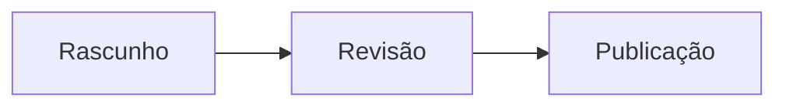
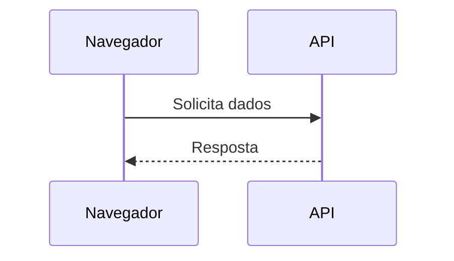
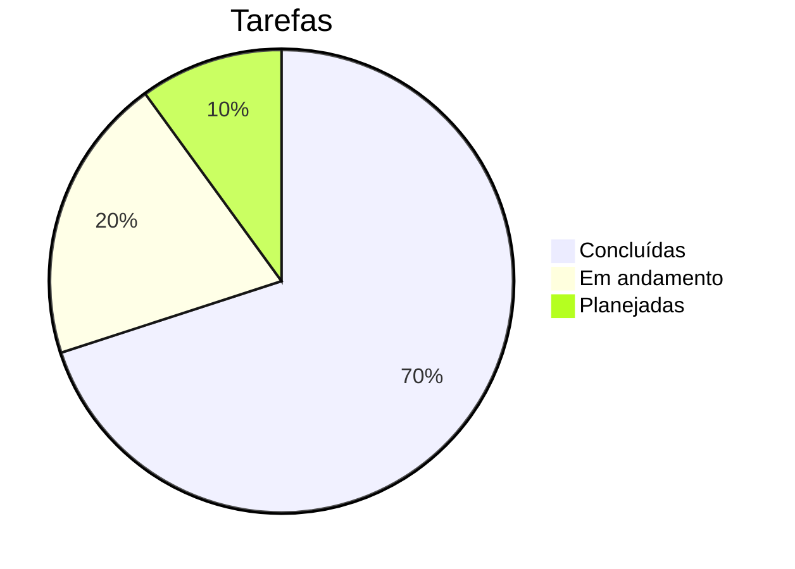

# Guia Completo de Markdown

Referência prática de Markdown para escrever, revisar e exportar documentos no **Moji**.
Cada seção mostra a sintaxe e, quando faz sentido, o resultado já renderizado.

## Sumário

- [Títulos](#t%C3%ADtulos)
- [Ênfase e estilo de texto](#%C3%AAnfase-e-estilo-de-texto)
- [Parágrafos e quebras de linha](#par%C3%A1grafos-e-quebras-de-linha)
- [Listas](#listas)
- [Listas de tarefas](#listas-de-tarefas)
- [Links](#links)
- [Imagens](#imagens)
- [Citações](#cita%C3%A7%C3%B5es)
- [Código](#c%C3%B3digo)
- [Tabelas](#tabelas)
- [Fórmulas matemáticas](#f%C3%B3rmulas-matem%C3%A1ticas)
- [Linhas horizontais](#linhas-horizontais)
- [HTML embutido](#html-embutido)
- [Caracteres de escape](#caracteres-de-escape)
- [Emojis e símbolos](#emojis-e-s%C3%ADmbolos)
- [Recursos estendidos](#recursos-estendidos)
- [Diagramas Mermaid](#diagramas-mermaid)
- [Boas práticas](#boas-pr%C3%A1ticas)

---

## Títulos

Use de um a seis `#` para criar títulos do nível 1 ao 6. O sumário lateral do Moji usa esses títulos para navegação, então mantenha os níveis em ordem.

~~~markdown
# Título de nível 1
## Título de nível 2
### Título de nível 3
#### Título de nível 4
##### Título de nível 5
###### Título de nível 6
~~~

> Dica: use apenas **um** `#` por documento, como título principal da página.

---

## Ênfase e estilo de texto

| Sintaxe | Resultado |
|---------|-----------|
| `*itálico*` ou `_itálico_` | *itálico* |
| `**negrito**` ou `__negrito__` | **negrito** |
| `***negrito e itálico***` | ***negrito e itálico*** |
| `~~riscado~~` | ~~riscado~~ |
| `` `código embutido` `` | `código embutido` |

Exemplo em contexto:

> Ao rodar `npm run typecheck`, o **TypeScript** é validado sem gerar arquivos; erros aparecem *inline* no terminal.

---

## Parágrafos e quebras de linha

Separe parágrafos com **uma linha em branco**. Uma quebra simples de linha, sem linha em branco, é ignorada por padrão.

~~~markdown
Primeiro parágrafo.

Segundo parágrafo, separado por linha em branco.
~~~

Para forçar quebra dentro do mesmo parágrafo, termine a linha com **dois espaços** ou use `\`:

~~~markdown
Linha um  
Linha dois na mesma ideia
~~~

---

## Listas

**Não ordenadas** — use `-`, `*` ou `+`. Indente com dois espaços para aninhar.

~~~markdown
- Item principal
  - Subitem
    - Sub-subitem
- Outro item
~~~

Resultado:

- Item principal
  - Subitem
    - Sub-subitem
- Outro item

**Ordenadas** — números seguidos de ponto. O Markdown renumera automaticamente.

~~~markdown
1. Primeiro passo
2. Segundo passo
   1. Subpasso A
   2. Subpasso B
3. Terceiro passo
~~~

Resultado:

1. Primeiro passo
2. Segundo passo
   1. Subpasso A
   2. Subpasso B
3. Terceiro passo

---

## Listas de tarefas

Use `- [ ]` para pendente e `- [x]` para concluído.

~~~markdown
- [x] Escrever o guia
- [x] Adicionar tabelas
- [ ] Revisar antes de exportar
~~~

Resultado:

- [x] Escrever o guia
- [x] Adicionar tabelas
- [ ] Revisar antes de exportar

---

## Links

~~~markdown
[Link embutido](https://example.com)
[Link com título](https://example.com "Aparece ao passar o mouse")
<https://example.com>  ← link automático
[Link de referência][ref]

[ref]: https://example.com
~~~

Links internos apontam para o *slug* de um título (o mesmo que o sumário usa):

~~~markdown
Volte ao [Sumário](#sum%C3%A1rio).
~~~

> No Moji, links `http`/`https` abrem no navegador do sistema, em nova aba, com `rel="noopener noreferrer"`.

---

## Imagens

Mesma sintaxe dos links, com `!` na frente. O texto entre colchetes é o **texto alternativo** (acessibilidade).

~~~markdown


~~~

Sempre descreva a imagem no texto alternativo — leitores de tela e a exportação dependem disso.

---

## Citações

Use `>` no início da linha. Podem conter outros elementos e ser aninhadas.

~~~markdown
> Citação simples.
>
> > Citação aninhada.
>
> — Autor, **Fonte**
~~~

Resultado:

> Citação simples.
>
> > Citação aninhada.
>
> — Autor, **Fonte**

---

## Código

**Embutido:** envolva com crases simples — `` `renderMarkdown()` ``.

**Em bloco:** use uma cerca de três crases e informe a linguagem para ativar o destaque de sintaxe (via `highlight.js`).

~~~markdown
```ts
export function renderMarkdown(source: string): string {
  const html = md.render(source ?? '')
  return DOMPurify.sanitize(html)
}
```
~~~

Resultado:

```ts
export function renderMarkdown(source: string): string {
  const html = md.render(source ?? '')
  return DOMPurify.sanitize(html)
}
```

Outros exemplos de linguagem:

```bash
npm install
npm run dev
```

```json
{
  "name": "moji",
  "version": "0.1.0"
}
```

---

## Tabelas

Colunas separadas por `|`. A segunda linha define a separação e o **alinhamento**:

- `:---` alinha à esquerda
- `:---:` centraliza
- `---:` alinha à direita

~~~markdown
| Recurso      | Suportado | Observações            |
| :----------- | :-------: | ---------------------: |
| Tabelas      |    Sim    |        Ótimo p/ dados  |
| Tarefas      |    Sim    |     Útil em checklists |
| Destaque     |    Sim    |         via highlight  |
~~~

Resultado:

| Recurso      | Suportado | Observações            |
| :----------- | :-------: | ---------------------: |
| Tabelas      |    Sim    |         Ótimo p/ dados |
| Tarefas      |    Sim    |     Útil em checklists |
| Destaque     |    Sim    |          via highlight |

Tabela comparativa mais densa:

| Formato | Extensão   | Exporta no Moji | Ideal para          |
| ------- | ---------- | :-------------: | ------------------- |
| HTML    | `.html`    |       Sim       | Publicar na web     |
| PDF     | `.pdf`     |       Sim       | Imprimir / arquivar |
| PNG     | `.png`     |       Sim       | Capturas e prévias  |
| Markdown| `.md`      |       Sim       | Editar a fonte      |

> As células aceitam formatação: **negrito**, *itálico*, `código` e links.

---

## Fórmulas matemáticas

A convenção padrão usa **LaTeX** entre cifrões: `$...$` para fórmula **na linha** e `$$...$$` para fórmula **em bloco** (destacada e centralizada).

**Na linha:**

~~~markdown
A energia é dada por $E = mc^2$ e o teorema é $a^2 + b^2 = c^2$.
~~~

Resultado: A energia é dada por $E = mc^2$ e o teorema é $a^2 + b^2 = c^2$.

**Em bloco:**

~~~markdown
$$
x = \frac{-b \pm \sqrt{b^2 - 4ac}}{2a}
$$
~~~

Resultado:

$$
x = \frac{-b \pm \sqrt{b^2 - 4ac}}{2a}
$$

Exemplos úteis de sintaxe:

| Objetivo        | LaTeX                                   |
| --------------- | --------------------------------------- |
| Fração          | `\frac{a}{b}`                           |
| Potência        | `x^{2}`                                 |
| Índice          | `x_{i}`                                 |
| Raiz            | `\sqrt{x}` · `\sqrt[3]{x}`              |
| Somatório       | `\sum_{i=1}^{n} i`                       |
| Integral        | `\int_{a}^{b} f(x)\,dx`                  |
| Limite          | `\lim_{x \to \infty} f(x)`              |
| Letras gregas   | `\alpha \beta \gamma \pi \Sigma \Omega` |
| Vetor           | `\vec{v}`                               |
| Matriz          | `\begin{bmatrix} a & b \\ c & d \end{bmatrix}` |

Bloco de exemplo completo:

~~~markdown
$$
\sum_{i=1}^{n} i = \frac{n(n+1)}{2}
\qquad
e^{i\pi} + 1 = 0
$$

$$
\int_{0}^{\infty} e^{-x^2}\,dx = \frac{\sqrt{\pi}}{2}
$$

$$
A = \begin{bmatrix} 1 & 2 \\ 3 & 4 \end{bmatrix}
$$
~~~

Resultado:

$$
\sum_{i=1}^{n} i = \frac{n(n+1)}{2}
\qquad
e^{i\pi} + 1 = 0
$$

$$
\int_{0}^{\infty} e^{-x^2}\,dx = \frac{\sqrt{\pi}}{2}
$$

$$
A = \begin{bmatrix} 1 & 2 \\ 3 & 4 \end{bmatrix}
$$

> **No Moji:** as fórmulas são renderizadas com **KaTeX** — `$…$` aparece na linha e `$$…$$` em bloco centralizado. Equações largas ganham rolagem horizontal, e uma fórmula inválida vira texto de erro em vermelho sem quebrar o resto do documento.

---

## Linhas horizontais

Três ou mais `-`, `*` ou `_` em uma linha própria, com linha em branco antes e depois.

~~~markdown
---
~~~

Produz um separador:

---

## HTML embutido

Markdown aceita HTML puro para casos que a sintaxe não cobre. No Moji, tudo passa por **DOMPurify**: tags e atributos inseguros (como `<script>` ou `onclick`) são removidos antes da prévia e da exportação.

~~~markdown
<details>
  <summary>Clique para expandir</summary>

  Conteúdo escondido, revelado ao clicar.
</details>
~~~

Resultado:

<details>
  <summary>Clique para expandir</summary>

  Conteúdo escondido, revelado ao clicar.
</details>

---

## Caracteres de escape

Use `\` antes de um caractere especial para exibi-lo literalmente, sem interpretá-lo.

~~~markdown
\*isto não fica itálico\*
\# isto não vira título
1\. isto não inicia lista
~~~

Escapáveis comuns: `` \ ` * _ { } [ ] ( ) # + - . ! | ``

---

## Emojis e símbolos

Cole emojis Unicode diretamente — funcionam em títulos, listas e tabelas.

~~~markdown
- ✅ Concluído
- 🚧 Em andamento
- ❌ Bloqueado
- 💡 Ideia
- ⚠️ Atenção
~~~

Resultado:

- ✅ Concluído
- 🚧 Em andamento
- ❌ Bloqueado
- 💡 Ideia
- ⚠️ Atenção

Símbolos comuns via HTML: `&copy;` → &copy;, `&rarr;` → &rarr;, `&hearts;` → &hearts;.

---

## Recursos estendidos

Além do Markdown básico, o Moji também renderiza extensões comuns.

**Subscrito e sobrescrito** — `~x~` e `^x^`:

~~~markdown
H~2~O · área = πr^2^ · a^n^ + b^n^
~~~

Resultado: H~2~O · área = πr^2^ · a^n^ + b^n^

**Destaque e inserção** — `==texto==` e `++texto++`:

~~~markdown
Isto é ==importante== e isto foi ++adicionado++.
~~~

Resultado: Isto é ==importante== e isto foi ++adicionado++.

**Emojis por atalho** — `:nome:`:

~~~markdown
:rocket: :sparkles: :white_check_mark: :warning: :bulb:
~~~

Resultado: :rocket: :sparkles: :white_check_mark: :warning: :bulb:

**Notas de rodapé** — marque com `[^id]` e defina a nota em qualquer lugar; ela aparece no rodapé do documento.

~~~markdown
Afirmação com fonte.[^fonte]

[^fonte]: Detalhe da referência, exibido no fim do documento.
~~~

Resultado: Afirmação com fonte.[^fonte]

**Listas de definição** — um termo seguido de linhas iniciadas por `:`.

~~~markdown
Markdown
: Linguagem de marcação leve para texto formatado.

KaTeX
: Motor rápido de renderização de fórmulas LaTeX.
~~~

Resultado:

Markdown
: Linguagem de marcação leve para texto formatado.

KaTeX
: Motor rápido de renderização de fórmulas LaTeX.

**Abreviações** — defina uma sigla e todas as ocorrências ganham dica ao passar o mouse.

~~~markdown
*[HTML]: HyperText Markup Language
~~~

*[HTML]: HyperText Markup Language

[^fonte]: Detalhe da referência, exibido no fim do documento.

---

## Diagramas Mermaid

O Moji renderiza diagramas Mermaid na prévia. Clique em um diagrama renderizado para abrir o visualizador, aplicar zoom, arrastar e exportar como PNG.

**Fluxograma**:

~~~markdown

~~~


**Diagrama de sequência**:



**Gráfico de pizza**:



<!-- MERMAID_EXAMPLES -->

---

## Boas práticas

- Comece com **um** título `#` e mantenha a hierarquia de níveis em ordem.
- Deixe **linhas em branco** entre blocos (títulos, listas, tabelas, citações).
- Prefira blocos cercados com linguagem para código de várias linhas.
- Escreva **texto alternativo** descritivo em toda imagem.
- Use tabelas para comparar; use listas para sequência ou coleção.
- **Revise na prévia** antes de exportar para HTML, PDF ou PNG.

---

> Guia gerado para o **Moji** · viewer e editor de Markdown. Abra este arquivo no app e alterne entre **edição** e **prévia** para ver cada exemplo.
