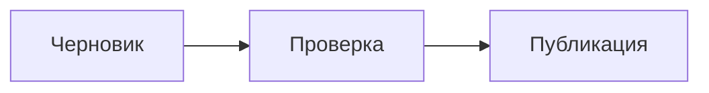
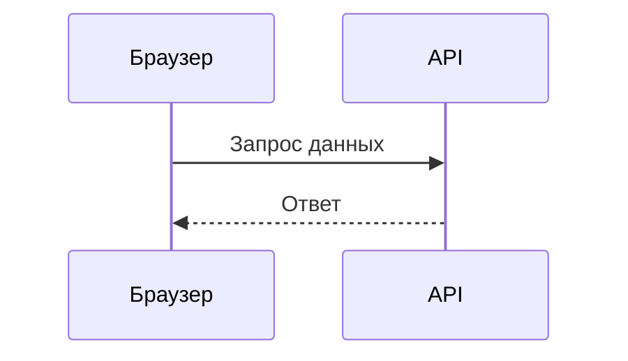
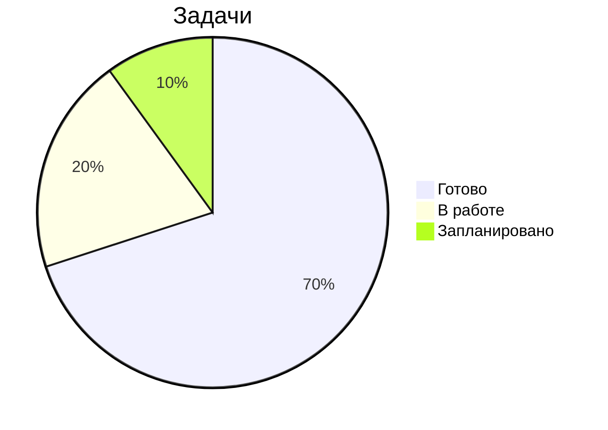

# Полное руководство по Markdown

Практический справочник по Markdown для написания, проверки и экспорта документов в **Moji**.
В каждом разделе показан синтаксис и, где уместно, результат рендеринга.

## Содержание

- [Заголовки](#%D0%B7%D0%B0%D0%B3%D0%BE%D0%BB%D0%BE%D0%B2%D0%BA%D0%B8)
- [Выделение и стили текста](#%D0%B2%D1%8B%D0%B4%D0%B5%D0%BB%D0%B5%D0%BD%D0%B8%D0%B5-%D0%B8-%D1%81%D1%82%D0%B8%D0%BB%D0%B8-%D1%82%D0%B5%D0%BA%D1%81%D1%82%D0%B0)
- [Абзацы и переносы строк](#%D0%B0%D0%B1%D0%B7%D0%B0%D1%86%D1%8B-%D0%B8-%D0%BF%D0%B5%D1%80%D0%B5%D0%BD%D0%BE%D1%81%D1%8B-%D1%81%D1%82%D1%80%D0%BE%D0%BA)
- [Списки](#%D1%81%D0%BF%D0%B8%D1%81%D0%BA%D0%B8)
- [Списки задач](#%D1%81%D0%BF%D0%B8%D1%81%D0%BA%D0%B8-%D0%B7%D0%B0%D0%B4%D0%B0%D1%87)
- [Ссылки](#%D1%81%D1%81%D1%8B%D0%BB%D0%BA%D0%B8)
- [Изображения](#%D0%B8%D0%B7%D0%BE%D0%B1%D1%80%D0%B0%D0%B6%D0%B5%D0%BD%D0%B8%D1%8F)
- [Цитаты](#%D1%86%D0%B8%D1%82%D0%B0%D1%82%D1%8B)
- [Код](#%D0%BA%D0%BE%D0%B4)
- [Таблицы](#%D1%82%D0%B0%D0%B1%D0%BB%D0%B8%D1%86%D1%8B)
- [Математические формулы](#%D0%BC%D0%B0%D1%82%D0%B5%D0%BC%D0%B0%D1%82%D0%B8%D1%87%D0%B5%D1%81%D0%BA%D0%B8%D0%B5-%D1%84%D0%BE%D1%80%D0%BC%D1%83%D0%BB%D1%8B)
- [Горизонтальные линии](#%D0%B3%D0%BE%D1%80%D0%B8%D0%B7%D0%BE%D0%BD%D1%82%D0%B0%D0%BB%D1%8C%D0%BD%D1%8B%D0%B5-%D0%BB%D0%B8%D0%BD%D0%B8%D0%B8)
- [Встроенный HTML](#%D0%B2%D1%81%D1%82%D1%80%D0%BE%D0%B5%D0%BD%D0%BD%D1%8B%D0%B9-html)
- [Экранирование символов](#%D1%8D%D0%BA%D1%80%D0%B0%D0%BD%D0%B8%D1%80%D0%BE%D0%B2%D0%B0%D0%BD%D0%B8%D0%B5-%D1%81%D0%B8%D0%BC%D0%B2%D0%BE%D0%BB%D0%BE%D0%B2)
- [Эмодзи и символы](#%D1%8D%D0%BC%D0%BE%D0%B4%D0%B7%D0%B8-%D0%B8-%D1%81%D0%B8%D0%BC%D0%B2%D0%BE%D0%BB%D1%8B)
- [Расширенные возможности](#%D1%80%D0%B0%D1%81%D1%88%D0%B8%D1%80%D0%B5%D0%BD%D0%BD%D1%8B%D0%B5-%D0%B2%D0%BE%D0%B7%D0%BC%D0%BE%D0%B6%D0%BD%D0%BE%D1%81%D1%82%D0%B8)
- [Диаграммы Mermaid](#%D0%B4%D0%B8%D0%B0%D0%B3%D1%80%D0%B0%D0%BC%D0%BC%D1%8B-mermaid)
- [Лучшие практики](#%D0%BB%D1%83%D1%87%D1%88%D0%B8%D0%B5-%D0%BF%D1%80%D0%B0%D0%BA%D1%82%D0%B8%D0%BA%D0%B8)

---

## Заголовки

Используйте от одного до шести `#` для создания заголовков уровней 1–6. Боковая панель Moji использует эти заголовки для навигации, поэтому соблюдайте порядок уровней.

~~~markdown
# Заголовок уровня 1
## Заголовок уровня 2
### Заголовок уровня 3
#### Заголовок уровня 4
##### Заголовок уровня 5
###### Заголовок уровня 6
~~~

> Совет: используйте только **один** `#` на документ в качестве основного заголовка страницы.

---

## Выделение и стили текста

| Синтаксис | Результат |
|---------|-----------|
| `*курсив*` или `_курсив_` | *курсив* |
| `**полужирный**` или `__полужирный__` | **полужирный** |
| `***полужирный курсив***` | ***полужирный курсив*** |
| `~~зачёркнутый~~` | ~~зачёркнутый~~ |
| `` `встроенный код` `` | `встроенный код` |

Пример в контексте:

> При запуске `npm run typecheck` **TypeScript** проверяется без создания файлов; ошибки отображаются *в строке* в терминале.

---

## Абзацы и переносы строк

Разделяйте абзацы **пустой строкой**. Простой перенос строки без пустой строки по умолчанию игнорируется.

~~~markdown
Первый абзац.

Второй абзац, отделённый пустой строкой.
~~~

Чтобы принудительно перенести строку внутри одного абзаца, завершите строку **двумя пробелами** или используйте `\`:

~~~markdown
Строка один  
Строка два в рамках той же мысли
~~~

---

## Списки

**Неупорядоченные** — используйте `-`, `*` или `+`. Делайте отступ в два пробела для вложенности.

~~~markdown
- Основной элемент
  - Вложенный элемент
    - Глубоко вложенный элемент
- Другой элемент
~~~

Результат:

- Основной элемент
  - Вложенный элемент
    - Глубоко вложенный элемент
- Другой элемент

**Упорядоченные** — числа с точкой. Markdown автоматически перенумеровывает.

~~~markdown
1. Первый шаг
2. Второй шаг
   1. Подшаг A
   2. Подшаг B
3. Третий шаг
~~~

Результат:

1. Первый шаг
2. Второй шаг
   1. Подшаг A
   2. Подшаг B
3. Третий шаг

---

## Списки задач

Используйте `- [ ]` для невыполненных и `- [x]` для выполненных.

~~~markdown
- [x] Написать руководство
- [x] Добавить таблицы
- [ ] Проверить перед экспортом
~~~

Результат:

- [x] Написать руководство
- [x] Добавить таблицы
- [ ] Проверить перед экспортом

---

## Ссылки

~~~markdown
[Встроенная ссылка](https://example.com)
[Ссылка с заголовком](https://example.com "Появляется при наведении")
<https://example.com>  ← автоматическая ссылка
[Ссылка в стиле сноски][ref]

[ref]: https://example.com
~~~

Внутренние ссылки указывают на *slug* заголовка (тот же, что используется в оглавлении):

~~~markdown
Вернуться к [Содержанию](#%D1%81%D0%BE%D0%B4%D0%B5%D1%80%D0%B6%D0%B0%D0%BD%D0%B8%D0%B5).
~~~

> В Moji ссылки `http`/`https` открываются в системном браузере, в новой вкладке, с `rel="noopener noreferrer"`.

---

## Изображения

Тот же синтаксис, что и для ссылок, с `!` впереди. Текст в скобках — это **альтернативный текст** (для доступности).

~~~markdown


~~~

Всегда описывайте изображение в альтернативном тексте — от этого зависят экранные читалки и экспорт.

---

## Цитаты

Используйте `>` в начале строки. Цитаты могут содержать другие элементы и быть вложенными.

~~~markdown
> Простая цитата.
>
> > Вложенная цитата.
>
> — Автор, **Источник**
~~~

Результат:

> Простая цитата.
>
> > Вложенная цитата.
>
> — Автор, **Источник**

---

## Код

**Встроенный:** оберните в одиночные обратные кавычки — `` `renderMarkdown()` ``

**Блок:** используйте ограждение из трёх обратных кавычек и укажите язык, чтобы включить подсветку синтаксиса (на базе `highlight.js`).

~~~markdown
```ts
export function renderMarkdown(source: string): string {
  const html = md.render(source ?? '')
  return DOMPurify.sanitize(html)
}
```
~~~

Результат:

```ts
export function renderMarkdown(source: string): string {
  const html = md.render(source ?? '')
  return DOMPurify.sanitize(html)
}
```

Другие примеры языков:

```bash
npm install
npm run dev
```

```json
{
  "name": "moji",
  "version": "0.1.0"
}
```

---

## Таблицы

Столбцы разделяются `|`. Вторая строка определяет разделитель и **выравнивание**:

- `:---` выравнивание влево
- `:---:` по центру
- `---:` выравнивание вправо

~~~markdown
| Возможность   | Поддержка | Примечания            |
| :------------ | :-------: | --------------------: |
| Таблицы       |    Да     |     Отлично для данных |
| Задачи        |    Да     |  Удобны в чек-листах  |
| Подсветка     |    Да     |     через highlight.js |
~~~

Результат:

| Возможность   | Поддержка | Примечания            |
| :------------ | :-------: | --------------------: |
| Таблицы       |    Да     |     Отлично для данных |
| Задачи        |    Да     |  Удобны в чек-листах  |
| Подсветка     |    Да     |     через highlight.js |

Более плотная сравнительная таблица:

| Формат   | Расширение | Экспорт в Moji | Лучше всего для       |
| -------- | ---------- | :------------: | --------------------- |
| HTML     | `.html`    |       Да       | Публикация в вебе     |
| PDF      | `.pdf`     |       Да       | Печать / архив        |
| PNG      | `.png`     |       Да       | Снимки и превью       |
| Markdown | `.md`      |       Да       | Редактирование исходника |

> Ячейки поддерживают форматирование: **полужирный**, *курсив*, `код` и ссылки.

---

## Математические формулы

Стандартное соглашение использует **LaTeX** между знаками доллара: `$...$` для **встроенных** формул и `$$...$$` для **выделенных** (блочных, по центру) формул.

**Встроенная:**

~~~markdown
Энергия выражается как $E = mc^2$, а теорема — $a^2 + b^2 = c^2$.
~~~

Результат: Энергия выражается как $E = mc^2$, а теорема — $a^2 + b^2 = c^2$.

**Выделенная:**

~~~markdown
$$
x = \frac{-b \pm \sqrt{b^2 - 4ac}}{2a}
$$
~~~

Результат:

$$
x = \frac{-b \pm \sqrt{b^2 - 4ac}}{2a}
$$

Полезные примеры синтаксиса:

| Назначение       | LaTeX                                   |
| ---------------- | --------------------------------------- |
| Дробь            | `\frac{a}{b}`                           |
| Верхний индекс   | `x^{2}`                                 |
| Нижний индекс    | `x_{i}`                                 |
| Корень           | `\sqrt{x}` · `\sqrt[3]{x}`              |
| Сумма            | `\sum_{i=1}^{n} i`                       |
| Интеграл         | `\int_{a}^{b} f(x)\,dx`                  |
| Предел           | `\lim_{x \to \infty} f(x)`              |
| Греческие буквы  | `\alpha \beta \gamma \pi \Sigma \Omega` |
| Вектор           | `\vec{v}`                               |
| Матрица          | `\begin{bmatrix} a & b \\ c & d \end{bmatrix}` |

Полный блочный пример:

~~~markdown
$$
\sum_{i=1}^{n} i = \frac{n(n+1)}{2}
\qquad
e^{i\pi} + 1 = 0
$$

$$
\int_{0}^{\infty} e^{-x^2}\,dx = \frac{\sqrt{\pi}}{2}
$$

$$
A = \begin{bmatrix} 1 & 2 \\ 3 & 4 \end{bmatrix}
$$
~~~

Результат:

$$
\sum_{i=1}^{n} i = \frac{n(n+1)}{2}
\qquad
e^{i\pi} + 1 = 0
$$

$$
\int_{0}^{\infty} e^{-x^2}\,dx = \frac{\sqrt{\pi}}{2}
$$

$$
A = \begin{bmatrix} 1 & 2 \\ 3 & 4 \end{bmatrix}
$$

> **В Moji:** формулы рендерятся с помощью **KaTeX** — `$…$` отображается в строке, а `$$…$$` — выделенным блоком по центру. Широкие уравнения получают горизонтальную прокрутку, а некорректная формула превращается в красный текст ошибки, не нарушая остальную часть документа.

---

## Горизонтальные линии

Три или более `-`, `*` или `_` на отдельной строке, с пустыми строками до и после.

~~~markdown
---
~~~

Создаёт разделитель:

---

## Встроенный HTML

Markdown принимает чистый HTML для случаев, не охваченных синтаксисом. В Moji всё проходит через **DOMPurify**: небезопасные теги и атрибуты (такие как `<script>` или `onclick`) удаляются перед предпросмотром и экспортом.

~~~markdown
<details>
  <summary>Нажмите, чтобы развернуть</summary>

  Скрытое содержимое, отображаемое по клику.
</details>
~~~

Результат:

<details>
  <summary>Нажмите, чтобы развернуть</summary>

  Скрытое содержимое, отображаемое по клику.
</details>

---

## Экранирование символов

Используйте `\` перед специальным символом, чтобы отобразить его буквально, без интерпретации.

~~~markdown
\*это не станет курсивом\*
\# это не станет заголовком
1\. это не начнёт список
~~~

Часто экранируемые символы: `` \ ` * _ { } [ ] ( ) # + - . ! | ``

---

## Эмодзи и символы

Вставляйте Unicode-эмодзи напрямую — они работают в заголовках, списках и таблицах.

~~~markdown
- ✅ Готово
- 🚧 В процессе
- ❌ Заблокировано
- 💡 Идея
- ⚠️ Внимание
~~~

Результат:

- ✅ Готово
- 🚧 В процессе
- ❌ Заблокировано
- 💡 Идея
- ⚠️ Внимание

Распространённые символы через HTML: `&copy;` → &copy;, `&rarr;` → &rarr;, `&hearts;` → &hearts;.

---

## Расширенные возможности

Помимо базового Markdown, Moji также рендерит распространённые расширения.

**Нижний и верхний индекс** — `~x~` и `^x^`:

~~~markdown
H~2~O · площадь = πr^2^ · a^n^ + b^n^
~~~

Результат: H~2~O · площадь = πr^2^ · a^n^ + b^n^

**Выделение и вставка** — `==текст==` и `++текст++`:

~~~markdown
Это ==важно==, а это было ++добавлено++.
~~~

Результат: Это ==важно==, а это было ++добавлено++.

**Эмодзи по сокращению** — `:имя:`:

~~~markdown
:rocket: :sparkles: :white_check_mark: :warning: :bulb:
~~~

Результат: :rocket: :sparkles: :white_check_mark: :warning: :bulb:

**Сноски** — отметьте `[^id]` и определите примечание в любом месте; оно появится внизу документа.

~~~markdown
Утверждение с источником.[^источник]

[^источник]: Детали ссылки, отображаемые в конце документа.
~~~

Результат: Утверждение с источником.[^источник]

**Списки определений** — термин, за которым следуют строки, начинающиеся с `:`.

~~~markdown
Markdown
: Лёгкий язык разметки для форматированного текста.

KaTeX
: Быстрый движок рендеринга математических формул LaTeX.
~~~

Результат:

Markdown
: Лёгкий язык разметки для форматированного текста.

KaTeX
: Быстрый движок рендеринга математических формул LaTeX.

**Аббревиатуры** — определите сокращение, и все его вхождения получат подсказку при наведении.

~~~markdown
*[HTML]: HyperText Markup Language
~~~

*[HTML]: HyperText Markup Language

[^источник]: Детали ссылки, отображаемые в конце документа.

---

## Диаграммы Mermaid

Moji отображает диаграммы Mermaid в предпросмотре. Нажмите на готовую диаграмму, чтобы открыть просмотрщик, изменить масштаб, переместить и экспортировать PNG.

**Блок-схема**:

~~~markdown

~~~


**Диаграмма последовательностей**:



**Круговая диаграмма**:



<!-- MERMAID_EXAMPLES -->

---

## Лучшие практики

- Начинайте с **одного** заголовка `#` и соблюдайте иерархию уровней по порядку.
- Оставляйте **пустые строки** между блоками (заголовки, списки, таблицы, цитаты).
- Для многострочного кода предпочитайте ограждённые блоки с указанием языка.
- Пишите описательный **альтернативный текст** для каждого изображения.
- Используйте таблицы для сравнений; списки — для последовательностей и коллекций.
- **Проверяйте в предпросмотре** перед экспортом в HTML, PDF или PNG.

---

> Руководство создано для **Moji** · просмотрщик и редактор Markdown. Откройте этот файл в приложении и переключайтесь между **редактированием** и **предпросмотром**, чтобы увидеть каждый пример.
