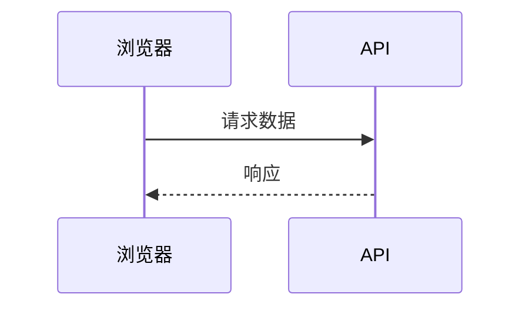
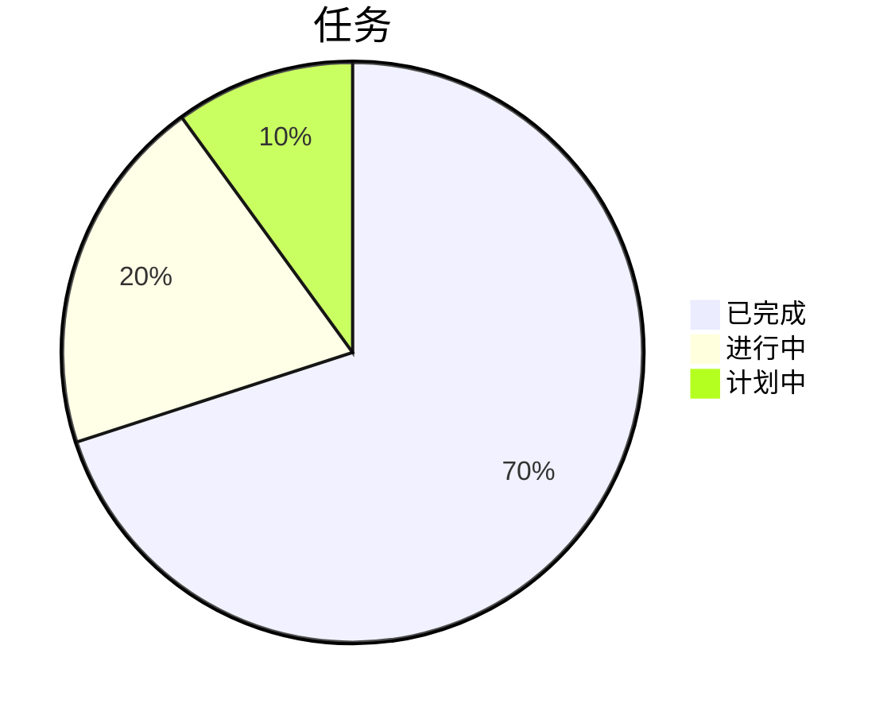

# Markdown 完整指南

在 **Moji** 中编写、审阅和导出文档的 Markdown 实用参考。
每个部分都展示语法，并在适当时展示渲染后的结果。

## 目录

- [标题](#%E6%A0%87%E9%A2%98)
- [强调与文本样式](#%E5%BC%BA%E8%B0%83%E4%B8%8E%E6%96%87%E6%9C%AC%E6%A0%B7%E5%BC%8F)
- [段落与换行](#%E6%AE%B5%E8%90%BD%E4%B8%8E%E6%8D%A2%E8%A1%8C)
- [列表](#%E5%88%97%E8%A1%A8)
- [任务列表](#%E4%BB%BB%E5%8A%A1%E5%88%97%E8%A1%A8)
- [链接](#%E9%93%BE%E6%8E%A5)
- [图片](#%E5%9B%BE%E7%89%87)
- [引用](#%E5%BC%95%E7%94%A8)
- [代码](#%E4%BB%A3%E7%A0%81)
- [表格](#%E8%A1%A8%E6%A0%BC)
- [数学公式](#%E6%95%B0%E5%AD%A6%E5%85%AC%E5%BC%8F)
- [水平线](#%E6%B0%B4%E5%B9%B3%E7%BA%BF)
- [内嵌 HTML](#%E5%86%85%E5%B5%8C-html)
- [转义字符](#%E8%BD%AC%E4%B9%89%E5%AD%97%E7%AC%A6)
- [表情与符号](#%E8%A1%A8%E6%83%85%E4%B8%8E%E7%AC%A6%E5%8F%B7)
- [扩展功能](#%E6%89%A9%E5%B1%95%E5%8A%9F%E8%83%BD)
- [Mermaid 图表](#mermaid-%E5%9B%BE%E8%A1%A8)
- [最佳实践](#%E6%9C%80%E4%BD%B3%E5%AE%9E%E8%B7%B5)

---

## 标题

使用一到六个 `#` 创建 1 到 6 级标题。Moji 的侧边栏大纲使用这些标题进行导航，因此请按顺序保持级别。

~~~markdown
# 一级标题
## 二级标题
### 三级标题
#### 四级标题
##### 五级标题
###### 六级标题
~~~

> 提示：每个文档只使用**一个** `#` 作为页面的主标题。

---

## 强调与文本样式

| 语法 | 效果 |
|---------|-----------|
| `*斜体*` 或 `_斜体_` | *斜体* |
| `**粗体**` 或 `__粗体__` | **粗体** |
| `***粗斜体***` | ***粗斜体*** |
| `~~删除线~~` | ~~删除线~~ |
| `` `行内代码` `` | `行内代码` |

上下文示例：

> 运行 `npm run typecheck` 时，**TypeScript** 在不生成文件的情况下进行验证；错误会*以内联方式*显示在终端中。

---

## 段落与换行

用**空行**分隔段落。没有空行的简单换行默认会被忽略。

~~~markdown
第一段。

第二段，用空行分隔。
~~~

要在同一段落内强制换行，在行末加**两个空格**或使用 `\`：

~~~markdown
第一行  
同一思路的第二行
~~~

---

## 列表

**无序列表** — 使用 `-`、`*` 或 `+`。用两个空格缩进来嵌套。

~~~markdown
- 主项目
  - 子项目
    - 子子项目
- 另一个项目
~~~

效果：

- 主项目
  - 子项目
    - 子子项目
- 另一个项目

**有序列表** — 数字后跟句点。Markdown 会自动重新编号。

~~~markdown
1. 第一步
2. 第二步
   1. 子步骤 A
   2. 子步骤 B
3. 第三步
~~~

效果：

1. 第一步
2. 第二步
   1. 子步骤 A
   2. 子步骤 B
3. 第三步

---

## 任务列表

使用 `- [ ]` 表示待办，`- [x]` 表示已完成。

~~~markdown
- [x] 编写指南
- [x] 添加表格
- [ ] 导出前审阅
~~~

效果：

- [x] 编写指南
- [x] 添加表格
- [ ] 导出前审阅

---

## 链接

~~~markdown
[内联链接](https://example.com)
[带标题的链接](https://example.com "悬停时显示")
<https://example.com>  ← 自动链接
[引用式链接][ref]

[ref]: https://example.com
~~~

内部链接指向标题的 *slug*（与大纲使用的相同）：

~~~markdown
返回[目录](#%E7%9B%AE%E5%BD%95)。
~~~

> 在 Moji 中，`http`/`https` 链接会在系统浏览器的新标签页中打开，并带有 `rel="noopener noreferrer"`。

---

## 图片

与链接语法相同，前面加 `!`。方括号中的文本是**替代文本**（用于无障碍访问）。

~~~markdown


~~~

始终在替代文本中描述图片 — 屏幕阅读器和导出功能依赖于此。

---

## 引用

在行首使用 `>`。可以包含其他元素，也可以嵌套。

~~~markdown
> 简单引用。
>
> > 嵌套引用。
>
> — 作者，**来源**
~~~

效果：

> 简单引用。
>
> > 嵌套引用。
>
> — 作者，**来源**

---

## 代码

**行内代码：** 用单个反引号包裹 — `` `renderMarkdown()` ``

**代码块：** 使用三个反引号围栏，并指定语言以启用语法高亮（由 `highlight.js` 提供支持）。

~~~markdown
```ts
export function renderMarkdown(source: string): string {
  const html = md.render(source ?? '')
  return DOMPurify.sanitize(html)
}
```
~~~

效果：

```ts
export function renderMarkdown(source: string): string {
  const html = md.render(source ?? '')
  return DOMPurify.sanitize(html)
}
```

其他语言示例：

```bash
npm install
npm run dev
```

```json
{
  "name": "moji",
  "version": "0.1.0"
}
```

---

## 表格

列用 `|` 分隔。第二行定义分隔线和**对齐方式**：

- `:---` 左对齐
- `:---:` 居中对齐
- `---:` 右对齐

~~~markdown
| 功能     | 支持情况 | 备注               |
| :------- | :------: | -----------------: |
| 表格     |    是    |     非常适合数据   |
| 任务     |    是    |   适合检查清单     |
| 语法高亮 |    是    |   通过 highlight.js |
~~~

效果：

| 功能     | 支持情况 | 备注               |
| :------- | :------: | -----------------: |
| 表格     |    是    |     非常适合数据   |
| 任务     |    是    |   适合检查清单     |
| 语法高亮 |    是    |   通过 highlight.js |

更详细的对比表格：

| 格式     | 扩展名     | Moji 中可导出 | 最适合             |
| -------- | ---------- | :-----------: | ------------------ |
| HTML     | `.html`    |      是       | 网页发布           |
| PDF      | `.pdf`     |      是       | 打印 / 归档        |
| PNG      | `.png`     |      是       | 截图和预览         |
| Markdown | `.md`      |      是       | 编辑源文件         |

> 单元格支持格式：**粗体**、*斜体*、`代码` 和链接。

---

## 数学公式

标准约定使用美元符号包裹 **LaTeX**：`$...$` 用于**行内**公式，`$$...$$` 用于**显示**（块级、居中）公式。

**行内公式：**

~~~markdown
能量由 $E = mc^2$ 给出，定理为 $a^2 + b^2 = c^2$。
~~~

效果：能量由 $E = mc^2$ 给出，定理为 $a^2 + b^2 = c^2$。

**显示公式：**

~~~markdown
$$
x = \frac{-b \pm \sqrt{b^2 - 4ac}}{2a}
$$
~~~

效果：

$$
x = \frac{-b \pm \sqrt{b^2 - 4ac}}{2a}
$$

实用语法示例：

| 用途           | LaTeX                                   |
| --------------- | --------------------------------------- |
| 分数            | `\frac{a}{b}`                           |
| 上标            | `x^{2}`                                 |
| 下标            | `x_{i}`                                 |
| 根号            | `\sqrt{x}` · `\sqrt[3]{x}`              |
| 求和            | `\sum_{i=1}^{n} i`                       |
| 积分            | `\int_{a}^{b} f(x)\,dx`                  |
| 极限            | `\lim_{x \to \infty} f(x)`              |
| 希腊字母        | `\alpha \beta \gamma \pi \Sigma \Omega` |
| 向量            | `\vec{v}`                               |
| 矩阵            | `\begin{bmatrix} a & b \\ c & d \end{bmatrix}` |

完整块级示例：

~~~markdown
$$
\sum_{i=1}^{n} i = \frac{n(n+1)}{2}
\qquad
e^{i\pi} + 1 = 0
$$

$$
\int_{0}^{\infty} e^{-x^2}\,dx = \frac{\sqrt{\pi}}{2}
$$

$$
A = \begin{bmatrix} 1 & 2 \\ 3 & 4 \end{bmatrix}
$$
~~~

效果：

$$
\sum_{i=1}^{n} i = \frac{n(n+1)}{2}
\qquad
e^{i\pi} + 1 = 0
$$

$$
\int_{0}^{\infty} e^{-x^2}\,dx = \frac{\sqrt{\pi}}{2}
$$

$$
A = \begin{bmatrix} 1 & 2 \\ 3 & 4 \end{bmatrix}
$$

> **在 Moji 中：** 公式使用 **KaTeX** 渲染 — `$…$` 显示为行内公式，`$$…$$` 显示为居中块级公式。过宽的公式将获得水平滚动，无效的公式将显示为红色错误文本，不会破坏文档的其余部分。

---

## 水平线

三个或更多 `-`、`*` 或 `_` 独占一行，前后各有一个空行。

~~~markdown
---
~~~

产生一条分隔线：

---

## 内嵌 HTML

Markdown 接受纯 HTML 来处理语法无法覆盖的情况。在 Moji 中，所有内容都经过 **DOMPurify** 处理：不安全的标签和属性（如 `<script>` 或 `onclick`）会在预览和导出前被移除。

~~~markdown
<details>
  <summary>点击展开</summary>

  隐藏内容，点击后显示。
</details>
~~~

效果：

<details>
  <summary>点击展开</summary>

  隐藏内容，点击后显示。
</details>

---

## 转义字符

在特殊字符前使用 `\` 可以按字面显示，而不被解释。

~~~markdown
\*这不会变成斜体\*
\# 这不会变成标题
1\. 这不会开始列表
~~~

常见可转义字符：`` \ ` * _ { } [ ] ( ) # + - . ! | ``

---

## 表情与符号

直接粘贴 Unicode 表情 — 它们可用于标题、列表和表格。

~~~markdown
- ✅ 已完成
- 🚧 进行中
- ❌ 已阻塞
- 💡 想法
- ⚠️ 警告
~~~

效果：

- ✅ 已完成
- 🚧 进行中
- ❌ 已阻塞
- 💡 想法
- ⚠️ 警告

通过 HTML 使用的常见符号：`&copy;` → &copy;，`&rarr;` → &rarr;，`&hearts;` → &hearts;。

---

## 扩展功能

除了基本 Markdown 之外，Moji 还渲染常见的扩展。

**下标和上标** — `~x~` 和 `^x^`：

~~~markdown
H~2~O · 面积 = πr^2^ · a^n^ + b^n^
~~~

效果：H~2~O · 面积 = πr^2^ · a^n^ + b^n^

**高亮和插入** — `==文本==` 和 `++文本++`：

~~~markdown
这是 ==重要的==，这是 ++插入的++。
~~~

效果：这是 ==重要的==，这是 ++插入的++。

**快捷表情** — `:名称:`：

~~~markdown
:rocket: :sparkles: :white_check_mark: :warning: :bulb:
~~~

效果：:rocket: :sparkles: :white_check_mark: :warning: :bulb:

**脚注** — 用 `[^id]` 标记，在任意位置定义注释；它会显示在文档底部。

~~~markdown
带有来源的声明。[^来源]

[^来源]: 参考详细信息，显示在文档末尾。
~~~

效果：带有来源的声明。[^来源]

**定义列表** — 术语后跟以 `:` 开头的行。

~~~markdown
Markdown
: 一种用于格式化文本的轻量级标记语言。

KaTeX
: 一种快速的 LaTeX 数学公式渲染引擎。
~~~

效果：

Markdown
: 一种用于格式化文本的轻量级标记语言。

KaTeX
: 一种快速的 LaTeX 数学公式渲染引擎。

**缩写** — 定义一个缩写，所有出现的地方都会在悬停时显示提示。

~~~markdown
*[HTML]: HyperText Markup Language
~~~

*[HTML]: HyperText Markup Language

[^来源]: 参考详细信息，显示在文档末尾。

---

## Mermaid 图表

Moji 会在预览中渲染 Mermaid 图表。点击已渲染的图表，可在查看器中缩放、拖动并导出 PNG。

**流程图**：

~~~markdown

~~~


**时序图**：



**饼图**：



<!-- MERMAID_EXAMPLES -->

---

## 最佳实践

- 以**一个** `#` 标题开头，并按顺序保持级别层次结构。
- 在块之间（标题、列表、表格、引用）留**空行**。
- 多行代码优先使用带语言标记的围栏式代码块。
- 为每张图片编写描述性的**替代文本**。
- 使用表格进行比较；使用列表表示顺序或集合。
- 导出为 HTML、PDF 或 PNG **之前先预览**。

---

> 为 **Moji** 生成的指南 · Markdown 查看器和编辑器。在应用中打开此文件，在**编辑**和**预览**之间切换以查看每个示例。
